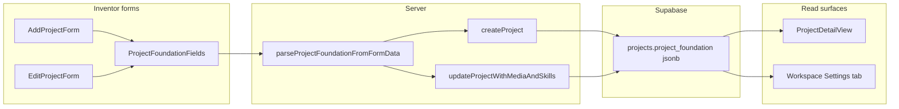

# Project foundation fields at creation

## Goal

When inventors create a project, capture structured foundation content as **form fields** (not Journey checklist tasks):

| Field | Form name | Purpose |
|-------|-----------|---------|
| Problem statement | `foundation_problem_statement` | What problem exists today |
| Vision | `foundation_vision` | Where the venture is headed |
| Goals | `foundation_goals` | Measurable or milestone goals |
| Target customer | `foundation_target_customer` | ICP / who benefits |
| Prior knowledge | `foundation_prior_knowledge` | Existing research, patents, experience |
| Pitch deck | `foundation_pitch_deck` | Deck outline or key slide points (full file upload stays in workspace Files) |

All fields **optional** at save time (same posture as Description). No server minimum length.

## Architecture



## 1. Database

New migration [`supabase/migrations/020_project_foundation.sql`](supabase/migrations/020_project_foundation.sql):

```sql
alter table public.projects
  add column if not exists project_foundation jsonb not null default '{}'::jsonb;
```

Shape (stored keys, all nullable strings when empty):

```ts
type ProjectFoundation = {
  problem_statement: string | null;
  vision: string | null;
  goals: string | null;
  target_customer: string | null;
  prior_knowledge: string | null;
  pitch_deck: string | null;
};
```

## 2. Shared lib + UI component

**New** [`lib/project-foundation.ts`](lib/project-foundation.ts):

- Export `ProjectFoundation`, `PROJECT_FOUNDATION_FIELD_DEFS` (key, label, hint, placeholder, maxLength ~2000 each)
- `parseProjectFoundationFromFormData(formData)` — trim, empty string → `null`
- `parseProjectFoundationFromDb(raw)` — safe JSON parse with defaults
- `projectFoundationToJson(foundation)` — for insert/update payload
- `hasAnyFoundationContent(foundation)` — for conditional display

**New** [`components/dashboard/project-foundation-fields.tsx`](components/dashboard/project-foundation-fields.tsx):

- Reusable fieldset titled **Project foundation** with short intro copy
- Six textareas in narrative order (problem → vision → goals → target customer → prior knowledge → pitch deck)
- Support `defaultValues?: ProjectFoundation` and `variant?: "dashboard" | "workspace"` (mirror [`project-description-field.tsx`](components/dashboard/project-description-field.tsx))

## 3. Wire forms and server actions

| File | Change |
|------|--------|
| [`components/dashboard/add-project-form.tsx`](components/dashboard/add-project-form.tsx) | Insert `<ProjectFoundationFields />` after `ProjectDescriptionField`, before team skills |
| [`components/dashboard/edit-project-form.tsx`](components/dashboard/edit-project-form.tsx) | Same, pass `defaultValues` from `project.project_foundation` |
| [`app/dashboard/projects/actions.ts`](app/dashboard/projects/actions.ts) | Extend `ProjectRow`; update `mapProjectRowFromDb`; include `project_foundation` in `createProject` insert and `updateProjectWithMediaAndSkills` update; add column to project `select` strings |

`createProject` today only seeds checklist when a template is selected — **no checklist changes** for this feature.

## 4. Arena / read path

| File | Change |
|------|--------|
| [`lib/projects-arena.ts`](lib/projects-arena.ts) | Add `project_foundation` to `ArenaProject`; extend all `ARENA_PROJECT_SELECT*` fragments; parse in `mapArenaRow` |
| [`components/idea-arena/project-detail-view.tsx`](components/idea-arena/project-detail-view.tsx) | Below the existing description summary, render a **Project foundation** block when `hasAnyFoundationContent` is true — labeled subsections, only showing non-empty fields |

Keep the existing description paragraph as the short summary; foundation is additive structured detail for professionals.

## 5. Copy and field guidance (in component)

- **Problem statement**: "What pain or gap exists today?"
- **Vision**: "What does success look like in 3–5 years?"
- **Goals**: "Near-term milestones or metrics you are working toward."
- **Target customer**: "Who is the primary user or buyer?"
- **Prior knowledge**: "Research, prototypes, patents, or domain experience you already have."
- **Pitch deck**: "Outline or key points from your deck. Upload the full file from workspace **Files** when ready."

Clarify in the section intro that these help professionals decide whether to join (aligned with description helper text).

## 6. Out of scope (v1)

- Journey checklist tasks or dependency graph nodes for foundation items
- Required validation / completion gates
- Pitch deck **file** upload on create (workspace Files remains the upload path)
- Admin template editor changes
- AI task suggestions using foundation fields (future enhancement in existing [`ai_workspace_task_assistance` plan](.cursor/plans/ai_workspace_task_assistance_686b3ebb.plan.md))

## Verification

1. Apply migration `020_project_foundation.sql` locally.
2. **Add project**: fill some foundation fields → save → reopen edit form → values persist.
3. **Edit project** (dashboard + workspace Settings): update foundation fields → save → persist.
4. **Idea Arena detail**: populated fields appear under description; empty fields omitted; legacy projects with `{}` unchanged.
5. Create with all foundation fields blank → save succeeds (no regression).
