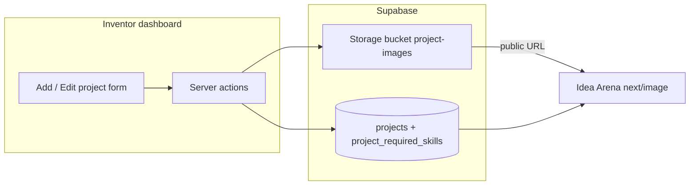

# Project representative image and required skills

## Current state

- [`supabase/migrations/001_projects.sql`](supabase/migrations/001_projects.sql) defines `projects` with `title`, `description`, `clerk_user_id`, `created_at` only.
- [`app/dashboard/projects/actions.ts`](app/dashboard/projects/actions.ts) inserts projects via the service-role client; there is **no** update path yet.
- Idea Arena uses a Picsum placeholder via [`components/idea-arena/utils.ts`](components/idea-arena/utils.ts) (`arenaProjectImageUrl`). [`project-card.tsx`](components/idea-arena/project-card.tsx) and [`project-detail-view.tsx`](components/idea-arena/project-detail-view.tsx) already expect a square image and a “Team Still Needed” area—ideal to wire to real data.
- [`next.config.ts`](next.config.ts) only allows `picsum.photos` for `next/image`; Supabase Storage host must be added once images are real.

## Data model

**1. Column on `projects`**

- Add nullable `representative_image_path text` — object path **inside** the bucket (e.g. `{project_id}/cover.webp`), not the full URL. Build public URLs in code with `NEXT_PUBLIC_SUPABASE_URL` + `/storage/v1/object/public/<bucket>/<path>`.

**2. Table `project_required_skills`**

- `id uuid` PK default `gen_random_uuid()`
- `project_id uuid not null references public.projects(id) on delete cascade`
- `skill_name text not null` (reasonable max length enforced in app, e.g. 120)
- `skill_description text not null` (e.g. max 500)
- `sort_order int not null default 0`
- `created_at timestamptz not null default now()`
- Index on `(project_id)`
- Enable RLS with **no policies** (same pattern as `projects`: server-only service role)

**3. Supabase Storage**

- New migration snippet: `insert into storage.buckets (id, name, public) values ('project-images', 'project-images', true);`
- Policy: **public `SELECT`** on `storage.objects` where `bucket_id = 'project-images'` so `next/image` can load URLs without signed cookies. **Uploads** use the existing service-role client (bypasses RLS), matching [`lib/supabase-server.ts`](lib/supabase-server.ts).

## Server logic

**Create flow** ([`createProject`](app/dashboard/projects/actions.ts))

1. Validate title (unchanged), optional description.
2. Parse optional `File` from `FormData` (allowed: jpeg/png/webp; max size e.g. 5MB). Reject invalid types early.
3. Parse repeated skill rows from `FormData` (e.g. paired `skill_name[]` / `skill_description[]` or indexed keys). Skip rows where both empty; enforce max count (e.g. 8–10) and non-empty name when description present.
4. `insert` project → get `id`.
5. If file: `supabase.storage.from('project-images').upload(path, buffer, { contentType, upsert: true })`, then `update` project `representative_image_path`. On upload failure after insert: either `delete` the new project row or return a clear error and leave the row (document choice; **prefer deleting the orphan row** in a `try/catch` for a clean UX).
6. `insert` skill rows for that `project_id`.
7. `revalidatePath` `/dashboard`, `/idea-arena`, and `/idea-arena/[projectId]` as needed.

**New: update flow for existing projects** (same file or small sibling module)

- `updateProjectWithMediaAndSkills(projectId, formData)` (name flexible): verify `auth()` + `getVenRoleForCurrentUser() === 'inventor'` + row `clerk_user_id === userId`.
- Optional new file: replace or clear path (if “remove image” is desired; optional v1 can be “replace only”).
- Replace skills: **delete** existing `project_required_skills` for that `project_id`, then **insert** new set (simplest and matches “set required skills” semantics).

**Types**

- Extend `ProjectRow` with `representative_image_path` and nested or parallel `required_skills: { skill_name, skill_description, sort_order }[]`.
- Extend [`ArenaProject`](lib/projects-arena.ts) the same way for display.

**Queries**

- [`listProjectsForCurrentUser`](app/dashboard/projects/actions.ts): `.select('..., project_required_skills(...)')` ordered by `sort_order`, `created_at` (confirm PostgREST embed name matches FK from `project_required_skills.project_id` → `projects.id`).
- [`listProjectsForArena`](lib/projects-arena.ts) / [`getProjectByIdForArena`](lib/projects-arena.ts): same select so cards and detail get image path + skills in one round trip.

**Image URL helper**

- Update [`arenaProjectImageUrl`](components/idea-arena/utils.ts) to accept the arena project shape: if `representative_image_path` is set, return the public Supabase URL; else keep current Picsum fallback.

## UI

**Dashboard — create** ([`components/dashboard/add-project-form.tsx`](components/dashboard/add-project-form.tsx))

- Optional file input (`accept="image/jpeg,image/png,image/webp"`).
- Dynamic list: “Add skill” adds a row with skill name + short description; remove row client-side. Submit as repeated fields compatible with the server parser.

**Dashboard — list** ([`app/dashboard/page.tsx`](app/dashboard/page.tsx))

- For each inventor project, render an **edit** surface (inline expandable block or small client component) reusing the same fields and a server action `updateProjectWithMediaAndSkills`. Prefill title/description/skills; show current thumbnail if path exists.

**Idea Arena**

- [`project-card.tsx`](components/idea-arena/project-card.tsx): keep layout; image `src` from updated helper (Supabase URL needs [`next.config.ts`](next.config.ts) `remotePatterns` for your `*.supabase.co` host, path `/storage/v1/object/public/**`).
- [`project-detail-view.tsx`](components/idea-arena/project-detail-view.tsx): replace placeholder “Team Still Needed” icon row with a list of **skill name + description** (stacked text or small cards). If no skills, keep a short empty state line.

## Config and ops

- Document in README or existing manual (only if you already document env vars): no new secrets; bucket created by migration.
- After deploy: run new migration in Supabase (local + hosted).

## Out of scope (unless you want them next)

- Image resizing/optimization on server (can add later with `sharp` or Supabase transforms).
- Private bucket + signed URLs (not needed if images are intentionally public in the arena).
- Matching professionals to skills (a separate [`join_team_skills_gate` plan](.cursor/plans/join_team_skills_gate_8eb72e37.plan.md) talks about **categories**—different from free-text inventor skills).
