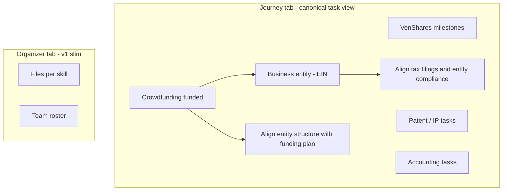

# Unified progress graph: milestones + skill tasks

## Direction (latest)

- **Milestones and skill tasks are related** — they share one dependency graph, not two silos.
- **One view** (Journey sidebar tab) shows **all** checkable nodes and **which depend on which**; locked items are grayed out.
- **Organizer task lists may be deprecated later** — v1 moves primary task interaction to Journey; Organizer keeps files, team roster, and recommend affordances per skill.

## Questionnaire results (earlier)

- **Scope:** Project-level journey + skill work, unified by dependencies.
- **Navigation:** Sidebar **Journey** → `?tab=journey`.
- **Locked UX:** Gray out + disable checkbox + list incomplete prerequisites; **still allow expand** for details.
- **Dependencies:** Multi-prerequisite AND logic; DAG (not strict linear order).

## Why one unified view


| Before (two silos)                                | After (one graph)                                                                                            |
| ------------------------------------------------- | ------------------------------------------------------------------------------------------------------------ |
| Milestones in Journey; skill tasks in Organizer   | All nodes in Journey tab with visible `dependsOn` relationships                                              |
| EIN milestone unrelated to Accounting tasks in UI | “Business entity formed” locks until crowdfunding **and** can gate “Align tax filings and entity compliance” |
| User hunts across tabs to understand order        | Single scroll: journey phases + skill work, grouped but one lock model                                       |


Organizer remains useful for **collaboration context** (files, who’s on the skill, recommend) without duplicating the task checklist.

## Target UX




**Journey tab layout (v1):**

1. Header: `{done} / {total} items complete`
2. **Section: VenShares journey** — milestone rows (expandable descriptions)
3. **Section per required skill** — leaf tasks from that skill’s checklist, filtered to nodes present in the dependency graph (v1: key tasks with cross-links; expand to all leaves over time)
4. Each row: checkbox, title, lock chip, expand chevron; when locked, show prerequisite titles inline or in tooltip

**Organizer tab (v1 change):**

- Keep skill accordion: **Files**, **Team**, **Recommend**
- **Remove** (or hide behind “Show legacy task list”) the nested task-list / subtask UI — avoids two places to check the same box
- Optional one-line link under each skill: “Tasks for this skill → Journey tab”

## Unified data model

### Nodes

Every checkable item is a **graph node** with a stable id:


| Node kind  | Id examples                        | Completion source                                   |
| ---------- | ---------------------------------- | --------------------------------------------------- |
| Milestone  | `std:journey:0` … `std:journey:5`  | New milestone slice in JSON **or** dedicated column |
| Skill leaf | Existing `std:Finance:M1:m2`, etc. | Existing `workspace_progress_checklist` leaf        |


### Dependencies (central registry)

**New column** — dependency edges are global, not duplicated per node file:

```sql
-- supabase/migrations/016_workspace_progress_dependencies.sql
alter table public.projects
  add column if not exists workspace_progress_dependencies jsonb not null default '{}'::jsonb;
```

Persisted shape (optional overrides only; template is source of truth in code):

```ts
type ProgressDependencyOverrides = {
  /** Rare per-project edge additions; v1 can be empty */
  extraEdges?: { nodeId: string; dependsOn: string[] }[];
};
```

**Template in code** `[lib/workspace-progress-graph.ts](lib/workspace-progress-graph.ts)`:

```ts
type ProgressGraphNodeDef = {
  id: string;
  kind: "milestone" | "skill";
  title: string;
  description?: string;
  /** Skill category when kind === "skill" */
  category?: ProfessionalJobCategory;
  dependsOn: string[];  // ids of any other nodes
};

const PROGRESS_GRAPH_TEMPLATE: ProgressGraphNodeDef[] = [ /* … */ ];
```

**Milestone nodes (v1):**


| Id              | Title                      | dependsOn                        |
| --------------- | -------------------------- | -------------------------------- |
| `std:journey:0` | Idea submitted             | `[]`                             |
| `std:journey:1` | IP and viability reviewed  | `[std:journey:0]`                |
| `std:journey:2` | Team assembled             | `[std:journey:1]`                |
| `std:journey:3` | Crowdfunding funded        | `[std:journey:2]`                |
| `std:journey:4` | Product built and launched | `[std:journey:2, std:journey:3]` |
| `std:journey:5` | Business entity formed     | `[std:journey:3, std:journey:4]` |


**Example cross-links (skill tasks → milestones):**


| Skill task (leaf id)                                          | dependsOn         |
| ------------------------------------------------------------- | ----------------- |
| Finance: “Align entity structure with funding plan”           | `[std:journey:3]` |
| Accounting: “Align tax filings and entity compliance”         | `[std:journey:5]` |
| Engineering: “Hand off artifacts for manufacturing or launch” | `[std:journey:4]` |


v1 starts with **milestones + curated cross-links**; remaining skill leaves have `dependsOn: []` until the graph is expanded. Custom user-added subtasks have no template edges (unlocked unless we add explicit deps later).

### Milestone completion storage

Store milestone `completed` flags in a small JSON blob (same migration or nested in dependencies column):

```ts
type ProjectMilestoneState = {
  milestones: { id: string; completed: boolean }[];
};
```

Skill task completion continues to use existing checklist JSON — **no duplicate completion state**.

### Graph builder

`buildProgressGraph(checklist, milestoneState, requiredCategories)` →

```ts
type ResolvedProgressNode = {
  id: string;
  kind: "milestone" | "skill";
  title: string;
  description?: string;
  category?: string;
  completed: boolean;
  dependsOn: string[];
  locked: boolean;
  blockers: { id: string; title: string }[];
};

type ProgressGraphView = {
  nodes: ResolvedProgressNode[];
  sections: { id: string; title: string; nodeIds: string[] }[];
};
```

Core helpers:

- `isNodeLocked(nodes, id)` — any incomplete `dependsOn`
- `getNodeBlockers(nodes, id)`
- `getTransitiveDependents(nodes, id)` — for cascade uncheck
- `validateProgressGraphTemplate()` — no cycles, valid ids

## Server actions

Replace milestone-only toggle with unified:

- `actionProgressToggleGraphNode(projectId, nodeId, completed)`
  - Resolve node kind → update milestone state **or** call existing `setLeafCompleted` on checklist
  - Reject `completed: true` when locked
  - On uncheck: cascade uncheck transitive dependents (milestones + skill leaves)
  - Single persist path + `revalidateArenaAndWorkspace` (skill completion still syncs `completed_job_categories`)

## UI components

`**[components/workspace/project-journey-panel.tsx](components/workspace/project-journey-panel.tsx)`** (rename optional → `progress-graph-panel.tsx`):

- Renders `ProgressGraphView` sections
- Optimistic toggle via `actionProgressToggleGraphNode`
- Locked row styling per earlier spec
- Expand panel: description + bullet list of incomplete prerequisites

`**[components/workspace/workspace-shell.tsx](components/workspace/workspace-shell.tsx)`:**

- Journey tab first in sidebar; `?tab=journey`
- Pass `progressGraph: ProgressGraphView` (built server-side)

`**[components/workspace/workspace-progress-panel.tsx](components/workspace/workspace-progress-panel.tsx)`:**

- Remove `SkillProgressBody` task-list rendering from Organizer (files + roster only)
- Dashboard embed uses same slim Organizer OR links to Journey for tasks

**Dashboard** `[dashboard-project-progress-card.tsx](components/dashboard/dashboard-project-progress-card.tsx)`:

- Header: `{graphDone} / {graphTotal} items` + **View journey** → `?tab=journey`
- Slim Organizer embed (no task lists)

## Arena / skill badges

Unchanged: `completed_job_categories` still driven by **skill checklist leaves** only (not milestones). Milestones are project lifecycle, not skill-slot completion.

## Deprecation path


| Phase              | Organizer                                         | Journey                                                   |
| ------------------ | ------------------------------------------------- | --------------------------------------------------------- |
| **v1 (this plan)** | Files, team, recommend; no task checklists        | Canonical task + milestone UI with dependencies           |
| **Later**          | Possibly rename to “Files” or merge into Messages | May add graph visualization, auto-complete from team data |
| **If unused**      | Remove Organizer tab entirely                     | Single progress surface                                   |


## Files to touch


| File                                                          | Change                                                   |
| ------------------------------------------------------------- | -------------------------------------------------------- |
| `supabase/migrations/016_workspace_progress_dependencies.sql` | Dependencies + milestone state JSONB                     |
| `lib/workspace-progress-graph.ts`                             | Template, builder, lock/cascade helpers                  |
| `lib/workspace-progress-checklist.ts`                         | Optional: export leaf id helpers for template cross-refs |
| `lib/workspace-organizer-bundle.server.ts`                    | Build and return `ProgressGraphView`                     |
| `app/idea-arena/[projectId]/workspace/actions.ts`             | `actionProgressToggleGraphNode`                          |
| `components/workspace/project-journey-panel.tsx`              | Unified graph UI                                         |
| `components/workspace/workspace-shell.tsx`                    | Journey tab                                              |
| `components/workspace/workspace-progress-panel.tsx`           | Slim Organizer (drop task lists)                         |
| `components/dashboard/dashboard-project-progress-card.tsx`    | Graph summary + Journey link                             |


## Out of scope (v1)

- Visual DAG chart / node graph diagram (list + prerequisite text is enough)
- Auto-completing milestones from team membership or crowdfunding API
- Custom user-defined dependency edges in UI
- Journey progress on Idea Arena cards
- Removing Organizer tab entirely

## Manual test plan

1. **Journey tab** shows milestone section + skill sections with all graph nodes.
2. Milestone 6 (EIN) locked until milestones 3 **and** 4 complete; tooltip lists both.
3. Accounting “entity compliance” locked until milestone 5 complete (cross-link).
4. Checking a node in Journey updates checklist completion and arena skill badges when it’s a skill leaf.
5. Unchecking crowdfunding cascades uncheck to dependent milestones **and** skill tasks that depend on it.
6. **Organizer** shows files/team only — no duplicate checkboxes.
7. Server rejects completing a locked node.
8. Dashboard links to Journey with accurate `{done}/{total}`.

