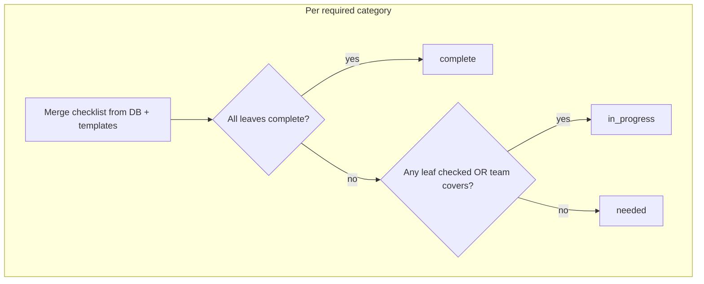

# Project page: in progress / complete from checklist## What happens today

- Toggling a checklist task calls [`actionProgressToggleLeaf`](app/idea-arena/[projectId]/workspace/actions.ts), which persists the checklist and updates `completed_job_categories` when **every** leaf in that category is done ([`completedCategoriesFromChecklist`](lib/workspace-progress-checklist.ts) in [`persistWorkspaceProgress`](lib/workspace-progress-sync.ts)). It also calls [`revalidateArenaAndWorkspace`](app/idea-arena/[projectId]/workspace/actions.ts) for `/idea-arena`, `/idea-arena/[projectId]`, and the workspace route—so the project page **will** refetch fresh DB data on the next render.
- [`mapArenaRow`](lib/projects-arena.ts) builds `category_statuses` like this:
  - **complete** — category is in `completed_job_categories`
  - **in_progress** — category is in the **team coverage union** (`project_members.covered_job_categories`), and not complete
  - **needed** — otherwise

So if someone checks tasks but **no one** has joined with that skill covered, the project page still shows **Needed**, even though work has started. That is the behavior to fix.

## Intended behavior (per skill / job category)

Use the same mental model as the workspace panel: merge the stored JSON with the standard template (so leaf lists exist even when the DB blob is empty), then:

1. **Complete** — all leaves in that category are checked (`categoryAllLeavesComplete`), which should match `completed_job_categories` after save; treating “all leaves complete” as authoritative avoids edge-case drift.
2. **In progress** — not complete, and (**any** leaf checked **or** team covers that category).
3. **Needed** — not complete, no checked leaves, and no team coverage.

## Implementation

1. **[`lib/projects-arena.ts`](lib/projects-arena.ts)**
   - Add `workspace_progress_checklist` to [`ARENA_PROJECT_SELECT`](lib/projects-arena.ts) (and document that migration [`008_workspace_progress_checklist.sql`](supabase/migrations/008_workspace_progress_checklist.sql) must be applied—same operational assumption as other JSON columns).
   - In `mapArenaRow`, after normalizing `required_job_categories` and `completed_job_categories`, compute     `merged = mergeChecklistWithTemplates(required_job_categories, row.workspace_progress_checklist ?? {}, completed_job_categories)`  
     (import from [`lib/workspace-progress-checklist.ts`](lib/workspace-progress-checklist.ts)).
   - For each required category, set `status` using the three rules above, reusing `categoryAllLeavesComplete(merged[category])` and a small helper (either inline or exported) for “any leaf completed” (e.g. `collectLeavesForCategory` + `some(l => l.completed)`).

2. **Optional tiny helper in [`lib/workspace-progress-checklist.ts`](lib/workspace-progress-checklist.ts)**  
   - e.g. `categoryHasAnyLeafCompleted(block)` — keeps `mapArenaRow` readable and matches existing patterns (`categoryAllLeavesComplete`).

No UI changes are strictly required: [`ProjectDetailView`](components/idea-arena/project-detail-view.tsx) and [`ProjectCard`](components/idea-arena/project-card.tsx) already consume `project.category_statuses`; [`WorkspaceProgressPanel`](components/workspace/workspace-progress-panel.tsx) uses the same slots from `getProjectByIdForArena`. Once derivation is fixed, all of those show **In progress** when any task is checked.

## Edge cases

- **Category with zero leaves** (only possible in odd custom structures): `categoryAllLeavesComplete` is false for empty lists today; status stays **needed** unless team covers—reasonable.
- **Legacy DB without `workspace_progress_checklist`**: if you need the same graceful degradation as `completed_job_categories`, extend the existing primary/legacy select split in `listProjectsForArena` / `getProjectByIdForArena` with a second fallback when the error references that column; otherwise rely on migration being applied.

## Verification

- Open workspace, check one task in a category with **no** team member covering that skill → project page (`/idea-arena/[id]`) should show **In progress** for that skill after refresh/navigation.
- Check all tasks in that category → **Complete**.
- Category with a team member but no boxes checked → still **In progress** (unchanged).
