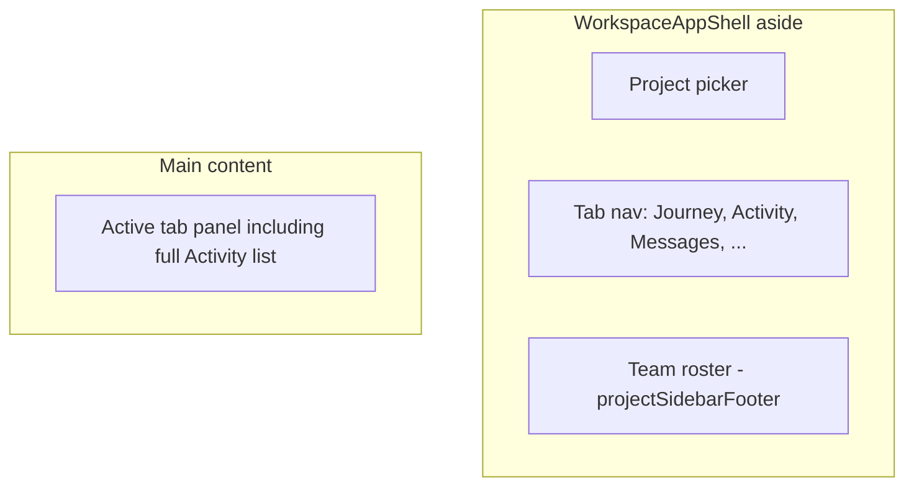
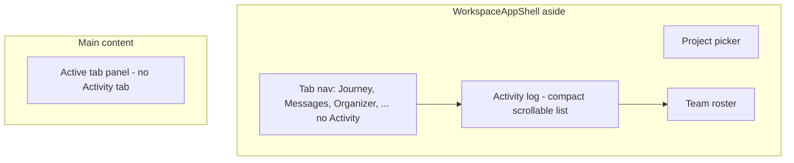

# Sidebar Activity log

## Goal

Relocate the existing activity feed (messages posted, files uploaded, status updates from `project_workspace_activities`) out of the main content area and into the left sidebar footer, **above** the Team roster. Rename user-facing copy from "Activity" / "Recent activity" to **"Activity log"**. Remove the Activity tab from the primary nav.

This does **not** implement the Journey flowchart from the prior message — only the existing activity stream moves.

## Current layout



Key files today:
- Tab definition and inline Activity panel: [`components/workspace/workspace-shell.tsx`](components/workspace/workspace-shell.tsx) (lines 61–67, 450–498)
- Sidebar shell + footer slot: [`components/workspace/workspace-app-shell.tsx`](components/workspace/workspace-app-shell.tsx)
- Team footer styling: [`components/workspace/workspace-team-roster.tsx`](components/workspace/workspace-team-roster.tsx)
- Data already loaded server-side: [`app/workspace/[projectId]/page.tsx`](app/workspace/[projectId]/page.tsx) via `listWorkspaceActivities`

## Target layout



## Implementation

### 1. Extract `WorkspaceActivityLog` component

Create [`components/workspace/workspace-activity-log.tsx`](components/workspace/workspace-activity-log.tsx):

- Props: `activities: WorkspaceActivityDTO[]`, `nameMap: Record<string, string>`
- Move display helpers from `workspace-shell.tsx`: `formatTime`, `activityDescription`, `activityMessagePermalink`, `isUrgentMessageActivity`
- Render a compact sidebar block matching Team roster patterns:
  - `border-t border-slate-600/80 p-3`
  - Header: `Activity log` (uppercase, `text-xs font-semibold text-slate-400`)
  - Scrollable list: `max-h-48 overflow-y-auto` (same cap as Team)
  - Each entry: actor name, action text, timestamp; urgent messages keep red accent; "View message" links use `Link` with existing `?tab=messages&board=...&m=...` permalinks
  - Empty state: `No activity yet.`

### 2. Adjust sidebar footer stacking

In [`components/workspace/workspace-shell.tsx`](components/workspace/workspace-shell.tsx):

- Remove `{ id: "activity", ... }` from `TABS` and drop unused `Activity` icon import
- Remove the `tab === "activity"` main-content panel block
- Change `projectSidebarFooter` from a single `<WorkspaceTeamRoster />` to a bottom stack:

```tsx
projectSidebarFooter={
  <div className="mt-auto flex flex-col">
    <WorkspaceActivityLog activities={activities} nameMap={nameMap} />
    <WorkspaceTeamRoster roster={roster} />
  </div>
}
```

In [`components/workspace/workspace-team-roster.tsx`](components/workspace/workspace-team-roster.tsx):

- Remove `mt-auto` from the Team root (the wrapper above now owns `mt-auto` so both Activity log and Team pin to the bottom together)

### 3. Legacy URL handling

In `resolveTabId` inside [`components/workspace/workspace-shell.tsx`](components/workspace/workspace-shell.tsx):

- Map `tab=activity` to a sensible default (e.g. `messages`) so old bookmarks do not land on a blank panel

No server or migration changes — `activities` and `nameMap` are already passed into `WorkspaceShell`.

## UX notes

- Activity log is **always visible** in the sidebar while in a project workspace (not a separate tab)
- Main nav gains one fewer item; Journey / Messages / Organizer / Meeting remain unchanged
- Limit display to the same data already fetched (100 items); sidebar scroll handles overflow

## Test plan

- Open a project workspace: Activity log appears above Team in the left sidebar
- Sidebar nav no longer shows an Activity tab
- Activity entries render correctly (names, descriptions, timestamps, urgent styling)
- "View message" links open the Messages tab at the right board/message
- `?tab=activity` redirects to default tab without a blank main panel
- Empty project shows "No activity yet." in the sidebar footer
