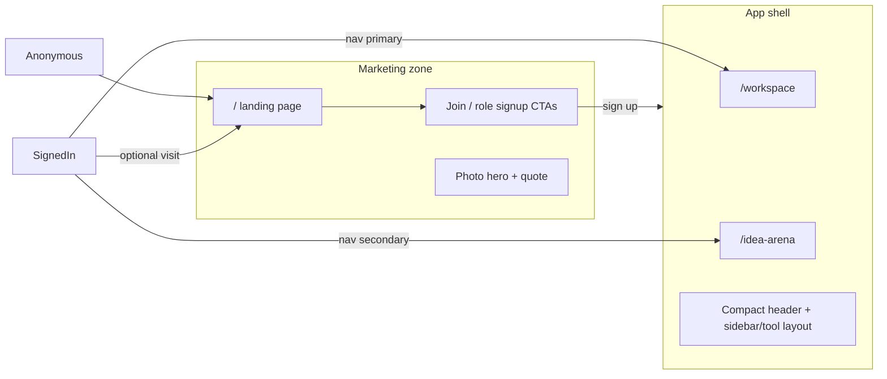

# Signed-in users: nav handoff + app visual identity

## Best practice (your instinct is correct)

**Do not deactivate every "Join VenShares" button** after signup. The landing page remains useful reference content, dual-role users may still want "add role" paths, and disabled CTAs feel broken.

**The levers are navigation + light visual differentiation**, not button suppression.

| Zone | Audience | Nav | Visual feel |
|------|----------|-----|-------------|
| Marketing (`/`) | Anonymous + occasional signed-in visitors | INVENT / EARN / INVEST + JOIN | Storytelling — photo hero, gradients, inspirational quote |
| App shell (`/workspace`, `/idea-arena`) | Signed-in members | Workspace + Idea Arena + account | Utility — compact header, tool layout, no marketing hero |

**Recommended for `/`:** nav-only (keep the page). No hard redirect to `/workspace` — preserves deep links and avoids jarring redirects.



---

## What the codebase already does well

[`app/page.tsx`](app/page.tsx) already swaps top nav for signed-in users: Idea Arena + Workspace + `VenUserButtonFromServer` instead of LOGIN + JOIN.

Middleware redirects signed-in users on `/auth/signup/*` to [`/auth/add-role/[role]`](app/auth/add-role/[role]/route.ts).

**Workspace is already partially differentiated:** dark project sidebar (`bg-slate-700`) and `bg-[#e8eef5]` main panel in [`workspace-app-shell.tsx`](components/workspace/workspace-app-shell.tsx).

---

## What still blurs marketing vs app

### 1. Idea Arena copies the marketing hero (biggest visual confusion)

[`app/idea-arena/page.tsx`](app/idea-arena/page.tsx) reuses `.hero-bg` and the **same inspirational quote** as the landing page:

```86:90:app/idea-arena/page.tsx
      <section className="hero-bg py-14 md:py-20 px-6 text-center">
        <p className="text-lg md:text-2xl text-white max-w-3xl mx-auto font-medium drop-shadow-md">
          If you find a job you love, you&apos;ll never work again...
        </p>
      </section>
```

This makes Arena feel like "more landing page" rather than a product screen.

### 2. App headers still use marketing nav links

[`arena-header.tsx`](components/idea-arena/arena-header.tsx) center nav points at `/#inventors`, `/#professionals`, etc. — pulling signed-in users back into marketing mode.

### 3. Shared surface tokens

Marketing and app both use `bg-[#f8fafc]`, identical sticky white header, identical `ven-cta` pill buttons, and similar light footers. Workspace inner panels diverge; Arena list/detail do not.

### 4. Landing body CTAs still always say Join

Three signup CTAs in [`app/page.tsx`](app/page.tsx) regardless of auth — should contextualize (see Step 3 below).

---

## Visual differentiation (slight — per your request)

Goal: **noticeably different, not a rebrand.** Users should feel they crossed a threshold into the product.

### Design principles

- **Marketing = story.** Photo hero, large inspirational type, section gradients, dark footer.
- **App = tool.** Compact title band, utilitarian typography, functional layout, minimal footer.
- **Keep brand color** (`#22c55e`) and logo — change *layout and atmosphere*, not identity.

### Concrete changes (low-risk, high signal)

#### A. App design tokens in [`globals.css`](app/globals.css)

Add a small app palette alongside existing marketing tokens:

```css
:root {
  /* existing --ven-green, --background, etc. */
  --ven-app-bg: #e8eef5;        /* matches workspace shell today */
  --ven-app-surface: #ffffff;
  --ven-app-header-bg: #f1f5f9; /* slightly cooler than marketing white */
  --ven-app-border: #cbd5e1;
}
```

Utility classes:

- `.ven-app-shell` — `background: var(--ven-app-bg); min-height: 100vh`
- `.ven-app-header` — denser header: `bg-[var(--ven-app-header-bg)]`, `border-b-2 border-[var(--ven-green)]` (thin green accent strip — subtle "you're in the app" cue)
- `.ven-app-page-title` — compact page heading row (replaces hero): `text-2xl font-semibold text-slate-900` + optional `text-sm text-slate-600` subtitle
- `.ven-cta-app` (optional) — same green, but `rounded-lg` + smaller padding for in-app actions; keep `.ven-cta` pill style on marketing only

#### B. Replace Arena marketing hero with compact app title band

In [`app/idea-arena/page.tsx`](app/idea-arena/page.tsx) and [`app/idea-arena/[projectId]/page.tsx`](app/idea-arena/[projectId]/page.tsx):

- **Remove** `hero-bg` section entirely.
- **Add** a slim title band under the header:

```tsx
<div className="border-b border-slate-200 bg-white px-6 py-6">
  <h1 className="ven-app-page-title">Idea Arena</h1>
  <p className="text-sm text-slate-600 mt-1">Browse projects and join teams that need your skills.</p>
</div>
```

Project detail page: title band shows project name instead of generic "Idea Arena".

#### C. Unify app chrome via `AppPageChrome`

Extract from [`workspace-page-chrome.tsx`](components/workspace/workspace-page-chrome.tsx) + arena page wrappers:

- `AppPageChrome` component wrapping: `AppTopNav` (updated arena header) + `ven-app-shell` body + minimal app footer
- Used by: `/workspace`, `/idea-arena`, `/idea-arena/[projectId]`
- Marketing [`app/page.tsx`](app/page.tsx) keeps its own nav + hero + dark footer — untouched visually

#### D. App header styling tweak

In the shared app header (evolved from [`arena-header.tsx`](components/idea-arena/arena-header.tsx)):

- Apply `.ven-app-header` classes (cooler bg, green bottom accent)
- Slightly tighter vertical padding (`py-3` vs marketing `py-4 md:py-5`)
- App nav links only: Idea Arena + Workspace (with `WorkspaceNavLink` toggle)
- Optional: subtle active-route underline on current section

#### E. What stays the same

- VenShares logo
- Green CTA color (shape may differ marketing pill vs app rounded-lg)
- Workspace dark sidebar — already reads as "app"; no change needed
- Marketing landing page look — intentionally unchanged

### What we are NOT doing

- Full color rebrand or new font family
- Dark mode app theme
- Removing all green from marketing
- Hard-redirecting signed-in users away from `/`

---

## Navigation + CTA changes (from prior plan)

### Step 1 — App header nav (highest impact)

Replace marketing pillar links in app header with Idea Arena + Workspace. Extract shared `AppTopNav` for signed-in landing nav parity.

### Step 2 — Contextual landing body CTAs

Server-render in [`app/page.tsx`](app/page.tsx) using [`lib/ven-role.server.ts`](lib/ven-role.server.ts):

| Section | Signed out | Has role | Missing role |
|---------|------------|----------|--------------|
| Inventors | Join → signup | Go to Workspace (inventor tab) | Add inventor role |
| Professionals | Join VenShares! | Browse Idea Arena (`skillFilter=mine`) | Add professional role |
| Earnings CTA | Join VenShares! | Same as professionals | Same |

### Step 3 — Verify

- Signed-out marketing experience unchanged
- Signed-in: nav points to app; body CTAs contextual
- Arena/workspace: no photo hero, compact title band, app header accent
- Workspace sidebar + app bg feel cohesive with Arena list page

---

## Implementation order

1. **App tokens + `AppPageChrome`** — foundation for consistent app look
2. **Remove Arena hero + add title band** — biggest single visual win
3. **App header nav + styling** — stops marketing bleed-through
4. **Landing body CTAs** — completes signed-in homepage handoff
5. **Manual visual + flow QA**

---

## Summary

Your framing is right: the homepage did its job. Signed-in users should enter a **slightly different-looking product zone** — not because the marketing site is hidden, but because Workspace and Idea Arena should feel like tools, not chapters of the same brochure. The nav handoff is primary; removing the Arena photo hero and adding a compact app chrome is the primary visual move. Workspace already leads the way with its sidebar; extend that utilitarian feel to Arena and the shared app header.
