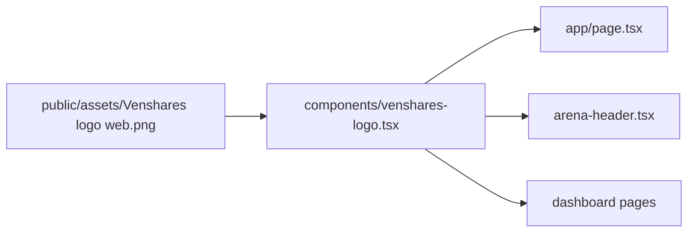

# Use new VenShares logo in all headers

## Current state

- New asset: [`public/assets/Venshares logo web.png`](public/assets/Venshares logo web.png) — full horizontal logo (arches + "VenShares" + tagline "Where Ideas meet Action").
- Headers still use text branding in **5 places**:
  - [`app/page.tsx`](app/page.tsx) — text logo + separate tagline
  - [`components/idea-arena/arena-header.tsx`](components/idea-arena/arena-header.tsx) — "VENSHARES" text
  - [`app/dashboard/page.tsx`](app/dashboard/page.tsx)
  - [`app/dashboard/profile/page.tsx`](app/dashboard/profile/page.tsx)
  - [`app/onboarding/professional/page.tsx`](app/onboarding/professional/page.tsx)



## Implementation

### 1. Add shared `VenSharesLogo` component

Create [`components/venshares-logo.tsx`](components/venshares-logo.tsx):

- Wrap in `Link href="/"` (matches existing dashboard/arena behavior; landing page currently has no link, but home-link on logo is standard).
- Render with `next/image` (already used elsewhere in the project).
- Source: `/assets/Venshares logo web.png` (served from `public/`; spaces in filename are fine in `src`).
- Sizing: fixed height via Tailwind (`h-9 sm:h-10` or similar), `w-auto`, `shrink-0` — keeps the wide logo readable without overflowing mobile headers.
- Alt text: `"VenShares — Where Ideas meet Action"`.
- Optional `priority` prop for the landing page sticky nav (LCP-friendly).
- Optional `className` prop for per-page tweaks if needed.

Example shape:

```tsx
<Link href="/" className="inline-flex shrink-0">
  <Image
    src="/assets/Venshares logo web.png"
    alt="VenShares — Where Ideas meet Action"
    width={240}
    height={56}
    className="h-9 sm:h-10 w-auto"
    priority={priority}
  />
</Link>
```

(`width`/`height` are intrinsic aspect-ratio hints for Next.js; visual size controlled by `className`.)

### 2. Replace text branding in each header

| File | Change |
|------|--------|
| [`app/page.tsx`](app/page.tsx) | Replace the text logo **and** the separate "Where Ideas Meet Action" tagline with `<VenSharesLogo priority />` (tagline is already in the image — avoids duplication) |
| [`components/idea-arena/arena-header.tsx`](components/idea-arena/arena-header.tsx) | Replace "VENSHARES" text link with `<VenSharesLogo />` |
| [`app/dashboard/page.tsx`](app/dashboard/page.tsx) | Replace text link with `<VenSharesLogo />` |
| [`app/dashboard/profile/page.tsx`](app/dashboard/profile/page.tsx) | Same |
| [`app/onboarding/professional/page.tsx`](app/onboarding/professional/page.tsx) | Same |

No changes needed to auth pages (they have no top-left site header) or [`next.config.ts`](next.config.ts) (local `public/` images do not need `remotePatterns`).

### 3. Quick visual check

After implementation, verify in browser:

- Logo appears top-left on landing, Idea Arena, dashboard, profile, and onboarding
- Logo scales cleanly on mobile (no header overflow)
- Logo links to `/` from all app routes
- Sticky headers still align nav items correctly

## Out of scope

- Favicon / Open Graph metadata (can be a follow-up)
- Renaming the PNG file (optional cleanup; not required for functionality)
