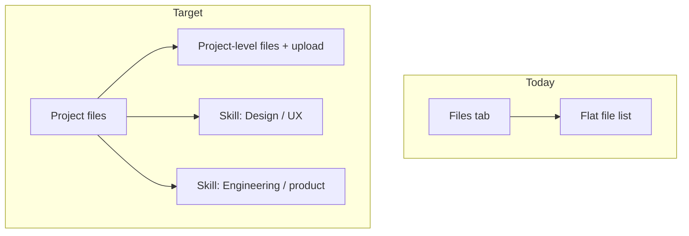

# Skill-grouped project files

## Current state

The Files tab in [`components/workspace/workspace-shell.tsx`](components/workspace/workspace-shell.tsx) (lines 683–890) is a **flat list** with heading **"Files"**. Uploads go to [`actionUploadWorkspaceFile`](app/idea-arena/[projectId]/workspace/actions.ts) with no skill metadata.

[`project_workspace_files`](supabase/migrations/0061_project_workspace.sql) stores only project-scoped file metadata — **no `job_category` column**. Progress already groups work by skill via [`progressCategoryStatuses`](lib/projects-arena.ts) (`ArenaCategorySlot[]` keyed on `ProfessionalJobCategory`).



## Target UX

| Level | Label | Contents |
|-------|-------|----------|
| 1 | **Project files** | Page heading (replaces "Files") |
| 2a | *(implicit project scope)* | Files with `job_category = null` + upload form with no skill selected |
| 2b | Each required skill | Collapsible section per entry in `progressCategoryStatuses` (same labels/order as Progress tab) + per-skill upload |

- **Both scopes supported** (per your choice): uploads can stay at project level or be assigned to a skill.
- **Empty skill sections still render** so users can upload into a skill before any files exist (mirrors Progress accordion pattern in [`workspace-progress-panel.tsx`](components/workspace/workspace-progress-panel.tsx) lines 691–745).
- **Removed files** section stays at the bottom, unchanged in behavior.
- **Legacy rows** (`job_category` null after migration) appear under the project-level group automatically.

## 1. Database migration

Add nullable skill association to [`project_workspace_files`](supabase/migrations/0061_project_workspace.sql):

```sql
alter table public.project_workspace_files
  add column if not exists job_category text null;

create index if not exists project_workspace_files_project_category_idx
  on public.project_workspace_files (project_id, job_category, created_at desc)
  where deleted_at is null;
```

No backfill — existing files remain project-level (`null`).

## 2. Server layer

### Types and persistence — [`lib/workspace.ts`](lib/workspace.ts)

- Extend `WorkspaceFileRow` with `job_category: string | null`.
- Update `uploadWorkspaceFileRecord(...)` to accept optional `jobCategory: string | null` and persist it.
- Include `job_category` in activity payload for `file_uploaded` (helps Activity tab context later).

### Upload action — [`app/idea-arena/[projectId]/workspace/actions.ts`](app/idea-arena/[projectId]/workspace/actions.ts)

In `actionUploadWorkspaceFile`:

- Read optional `job_category` from `FormData`.
- If empty/missing → store `null` (project-level).
- If set → normalize with `resolveProfessionalJobCategory` and validate it is in the project's `required_job_categories` (reuse the same load pattern as progress actions, lines 105–119).
- Reject invalid/unknown categories with a clear error.

### Page DTO — [`app/idea-arena/[projectId]/workspace/page.tsx`](app/idea-arena/[projectId]/workspace/page.tsx)

- Map `job_category` into `WorkspaceFileDTO`.

## 3. UI — extract `WorkspaceFilesPanel`

Create [`components/workspace/workspace-files-panel.tsx`](components/workspace/workspace-files-panel.tsx) (parallel to [`workspace-progress-panel.tsx`](components/workspace/workspace-progress-panel.tsx)) and move file logic out of the shell.

**Props:**

```typescript
{
  projectId: string;
  files: WorkspaceFileDTO[];
  categoryStatuses: ArenaCategorySlot[]; // same prop Progress uses
  nameMap: Record<string, string>;
  currentUserId: string;
  isProjectOwner: boolean;
  projectOwnerId: string; // for canRemoveFile
}
```

**Layout:**

1. **Heading:** `Project files`
2. **Project-level block**
   - Small sublabel, e.g. "General project files" (optional; keeps skill sections visually distinct)
   - Upload `<form>` with hidden/empty `job_category`
   - List active files where `job_category === null`
3. **Skill sections** — map `categoryStatuses`; for each skill:
   - Collapsible header (reuse ChevronDown + `aria-expanded` pattern from Progress)
   - Upload `<form>` with `<input type="hidden" name="job_category" value={slot.category} />`
   - List active files where `file.job_category === slot.category`
4. **Removed files** — move existing deprecated collapsible block here unchanged

**Grouping helper** (client-side `useMemo`):

```typescript
const byCategory = groupFiles(activeFiles);
// { projectLevel: File[], bySkill: Map<ProfessionalJobCategory, File[]> }
```

Extract the existing file row (preview, download, remove confirm) into a small `WorkspaceFileRow` subcomponent inside the panel to avoid duplicating ~80 lines per section.

### Shell wiring — [`components/workspace/workspace-shell.tsx`](components/workspace/workspace-shell.tsx)

- Extend `WorkspaceFileDTO` with `job_category: string | null`.
- Replace inline Files tab JSX with `<WorkspaceFilesPanel ... />`.
- Pass `progressCategoryStatuses`, `currentUserId`, and owner id for remove permissions.

## 4. Out of scope (follow-ups)

These were mentioned in an earlier conversation but are **not** in this message — defer unless you want them bundled:

- Renaming Progress tab to **Organizer** or merging Files into that tab
- File **description** metadata column
- Editing skill assignment on existing files (move between groups)

## Manual verification

- Upload with no skill → file appears under project-level section only
- Upload inside a skill section → file appears only in that skill group
- Invalid `job_category` in FormData → server rejects
- Legacy files (pre-migration) show under project-level
- Preview, download, remove, and removed-files collapsible still work
- Project with zero required skills shows only project-level section
- Skill section order matches Progress tab

## Files to touch

| File | Change |
|------|--------|
| `supabase/migrations/012_workspace_file_job_category.sql` | New column + index |
| [`lib/workspace.ts`](lib/workspace.ts) | Type + insert |
| [`app/idea-arena/[projectId]/workspace/actions.ts`](app/idea-arena/[projectId]/workspace/actions.ts) | Validate + pass category on upload |
| [`app/idea-arena/[projectId]/workspace/page.tsx`](app/idea-arena/[projectId]/workspace/page.tsx) | DTO mapping |
| [`components/workspace/workspace-files-panel.tsx`](components/workspace/workspace-files-panel.tsx) | **New** — hierarchical UI |
| [`components/workspace/workspace-shell.tsx`](components/workspace/workspace-shell.tsx) | Wire panel; slim Files tab |
