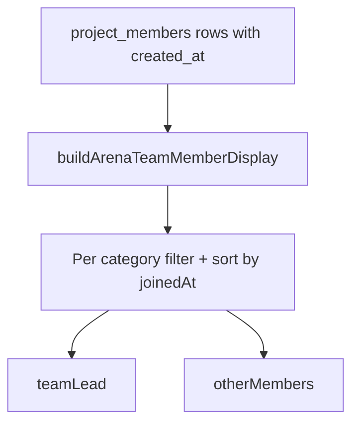

# Skill team lead and members

## Current state

- Team membership lives in `project_members` with `covered_job_categories` (snapshot at join) and `created_at` ([`003_project_members.sql`](supabase/migrations/003_project_members.sql)).
- [`getArenaTeamDisplay`](lib/arena-team.ts) builds `categoryCoverage[]` with a flat `members` list per skill (no ordering, no lead concept).
- **Idea Arena detail** ([`project-detail-view.tsx`](components/idea-arena/project-detail-view.tsx)) shows overlapping avatars + “Covered by …” per skill row.
- **Workspace Progress** ([`workspace-progress-panel.tsx`](components/workspace/workspace-progress-panel.tsx)) shows skill name, status badge, and subtask counts only — no people.
- Join order is already implicit: [`joinProjectAsProfessional`](lib/project-members.ts) inserts one row per professional with `created_at default now()`.

## Rule (v1)

For each required skill category:

1. Collect members whose `coveredCategories` includes that category.
2. Sort by `project_members.created_at` ascending.
3. **First = team lead**; **rest = other team members**.

No DB migration. “Switch roles later” can add a persisted override column/table without changing this derivation as the default fallback.



## 1. Server — extend arena team model

**File:** [`lib/arena-team.ts`](lib/arena-team.ts)

- Add `joinedAt: string` to `ArenaTeamMemberDisplay` (ISO timestamp from DB; used for sorting, can be passed to UI if useful).
- Select `created_at` in both `getArenaTeamDisplay` and `getArenaTeamPreviewForProjects` queries (alongside existing fields).
- Extend `ArenaCategoryCoverage`:

```typescript
export type ArenaCategoryCoverage = {
  category: ProfessionalJobCategory;
  covered: boolean;
  teamLead: ArenaTeamMemberDisplay | null;
  otherMembers: ArenaTeamMemberDisplay[];
  /** All covering members, lead first — convenience for callers that need the full list */
  members: ArenaTeamMemberDisplay[];
};
```

- Add helper `buildCategoryCoverage(requiredCategories, membersWithJoinDate)` that, per category:
  - filters covering members
  - sorts by `joinedAt`
  - sets `teamLead`, `otherMembers`, and `members` (lead-first)

Keep `members` populated for backward compatibility with existing avatar loops; new UI will use `teamLead` / `otherMembers` explicitly.

## 2. Shared UI component

**New file:** [`components/idea-arena/skill-team-roster.tsx`](components/idea-arena/skill-team-roster.tsx)

Small presentational component used in both surfaces:

- Props: `teamLead`, `otherMembers`, optional `variant: "compact" | "detail"`, optional `complete?: boolean` (for “Previously led by …” copy).
- **Compact** (workspace skill header): one line under subtask count — lead avatar + name labeled **Team lead**; if others exist, overlapping mini-avatars + “+N” or comma-separated names.
- **Detail** (project detail skill row): replace generic “Covered by …” with:
  - **Team lead:** avatar + name
  - **Team members:** avatars + names (only when `otherMembers.length > 0`)
  - When `complete`, prefix with “Previously” (mirror today’s complete-state copy).
- Reuse [`ArenaUserAvatar`](components/idea-arena/arena-user-avatar.tsx).
- When no one covers the skill: render nothing (existing “Recommend a professional” / checklist notes stay as-is).

## 3. Idea Arena project detail

**File:** [`components/idea-arena/project-detail-view.tsx`](components/idea-arena/project-detail-view.tsx)

In each skill row (~lines 158–190):

- Replace flat avatar stack + “Covered by …” with `<SkillTeamRoster variant="detail" … />`.
- Derive `teamLead` / `otherMembers` from `coverageByCategory.get(category)`.
- Keep existing checklist-progress and coverage-pending notes unchanged.

No page-level changes needed — [`app/idea-arena/[projectId]/page.tsx`](app/idea-arena/[projectId]/page.tsx) already passes `categoryCoverage`.

## 4. Workspace Progress tab

**Files:**

- [`app/idea-arena/[projectId]/workspace/page.tsx`](app/idea-arena/[projectId]/workspace/page.tsx) — call `getArenaTeamDisplay(projectId, arenaProject.required_job_categories)` alongside existing fetches; pass `categoryCoverage` into `WorkspaceShell`.
- [`components/workspace/workspace-shell.tsx`](components/workspace/workspace-shell.tsx) — thread `categoryCoverage` prop to `WorkspaceProgressPanel`.
- [`components/workspace/workspace-progress-panel.tsx`](components/workspace/workspace-progress-panel.tsx) — accept `categoryCoverage`; in each skill header (below subtask count, ~line 729), render `<SkillTeamRoster variant="compact" … />`.

Build a `Map<category, ArenaCategoryCoverage>` inside the panel (same pattern as detail view).

## 5. Out of scope (noted for later)

- Persisted role overrides / “transfer team lead” UI
- Arena project cards ([`project-card.tsx`](components/idea-arena/project-card.tsx)) — person-centric rail, not per-skill lead
- Inventor as skill lead — only `project_members` professionals count

## Verification

- **No members on a skill:** roster hidden; Recommend menu still shows when `!teamCoversCategory`.
- **One member:** shows as Team lead only; no “Team members” line.
- **Two+ members, different join times:** earliest joiner is lead for that skill even if they cover multiple skills.
- **Same join time edge case:** stable tie-break by `clerkUserId` sort after `created_at`.
- **Complete skill:** detail variant shows “Previously” lead/members copy.
- **Workspace + detail:** both surfaces show consistent lead/member for the same project data.
