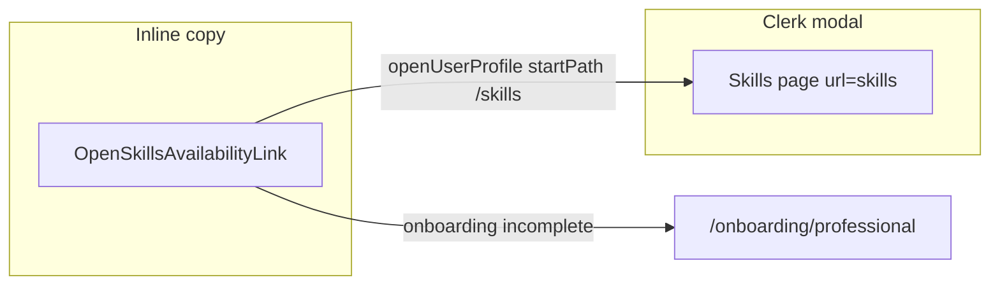

# Skills link and subtitle UX

## Problem

In [`components/dashboard/dashboard-professional-header.tsx`](components/dashboard/dashboard-professional-header.tsx), the subtitle uses `text-sm`, which reads too small under the `text-2xl` heading. The skills guidance is plain text with arrow breadcrumbs, so users must manually find the avatar menu instead of jumping straight to **Skills & availability**.

The same breadcrumb copy appears in two other places:

- [`app/idea-arena/page.tsx`](app/idea-arena/page.tsx) (empty-skills CTA)
- [`app/dashboard/profile/page.tsx`](app/dashboard/profile/page.tsx) (intro paragraph)

## Approach

### 1. Reusable client link component

Add [`components/profile/open-skills-availability-link.tsx`](components/profile/open-skills-availability-link.tsx) (`"use client"`):

- Use `useClerk().openUserProfile({ __experimental_startPath: "/skills" })` — matches the custom page already registered in [`components/ven-user-button.tsx`](components/ven-user-button.tsx) (`url="skills"`).
- Style like existing inline CTAs: `text-[#22c55e] font-medium hover:underline` (same as Idea Arena’s workspace link).
- Render as a `<button type="button">` styled as a link (correct semantics for opening a modal).
- Fallback when the Skills modal page is not available (professional onboarding incomplete, or Clerk not loaded yet): render a Next.js `<Link href="/onboarding/professional">` instead. Use the same client-safe helpers already used in `VenUserButton`: `hasProfessionalRole` + `isProfessionalOnboardingComplete` from [`lib/ven-role.ts`](lib/ven-role.ts) / [`lib/professional-onboarding.ts`](lib/professional-onboarding.ts).

```tsx
// sketch
const clerk = useClerk();
const { user, isLoaded } = useUser();
const canOpenSkillsModal =
  isLoaded &&
  hasProfessionalRole(meta) &&
  isProfessionalOnboardingComplete(meta);

if (canOpenSkillsModal) {
  return (
    <button
      type="button"
      onClick={() =>
        clerk.openUserProfile({ __experimental_startPath: "/skills" })
      }
      className="text-[#22c55e] font-medium hover:underline"
    >
      Skills & availability
    </button>
  );
}
return (
  <Link href="/onboarding/professional" className="...">
    Skills & availability
  </Link>
);
```

**Why this works:** `VenUserButton` is already mounted in the workspace/Idea Arena header via [`components/idea-arena/arena-header.tsx`](components/idea-arena/arena-header.tsx), so the custom Skills page is registered when `profileMode === "professional-complete"`.



### 2. Enlarge subtitle in professional header

In [`components/dashboard/dashboard-professional-header.tsx`](components/dashboard/dashboard-professional-header.tsx):

| Element | Before | After |
|---------|--------|-------|
| Subtitle (“Track checklist…”) | `text-sm` | `text-base` |
| Skills helper line | breadcrumb text | link component |

**Updated copy (header):**

- Line 1: `Track checklist progress on teams you've joined.` — `text-base text-slate-600 mt-1`
- Line 2: `Update job categories and availability from your account menu (top right) — ` + `<OpenSkillsAvailabilityLink />` + `.`

Remove the `→ Manage account →` breadcrumb entirely; the link opens the destination directly.

### 3. Update Idea Arena empty-skills CTA

In [`app/idea-arena/page.tsx`](app/idea-arena/page.tsx) (~lines 89–102), replace the bold span + breadcrumb with the shared link:

**Before:** `Open your account menu (top right) → Manage account → Skills & availability, or edit on the full profile page.`

**After:** `Add your job categories from ` + `<OpenSkillsAvailabilityLink />` + ` in your account menu, or ` + existing `/dashboard/profile` link + `.`

(Keeps the full-profile fallback that is already there.)

### 4. Update profile page intro

In [`app/dashboard/profile/page.tsx`](app/dashboard/profile/page.tsx) (~lines 62–66), replace the breadcrumb sentence with:

`You can also edit categories and hours in ` + `<OpenSkillsAvailabilityLink />` + ` from your account menu.`

## Files to change

| File | Change |
|------|--------|
| `components/profile/open-skills-availability-link.tsx` | **New** shared client link |
| `components/dashboard/dashboard-professional-header.tsx` | Larger subtitle + link |
| `app/idea-arena/page.tsx` | Link in empty-skills CTA |
| `app/dashboard/profile/page.tsx` | Link in intro copy |

No schema, routing, or Clerk config changes.

## Verification

1. **Workspace → Professional tab** (user with completed onboarding): subtitle reads larger; clicking **Skills & availability** opens the Clerk modal on the Skills page.
2. **Idea Arena** with “Matches my skills” filter and empty categories: link opens the same modal; “full profile page” link still works.
3. **Professional with incomplete onboarding**: link goes to `/onboarding/professional` instead of a broken modal tab.
4. **After completing onboarding**: link opens modal Skills page without a full page reload.
