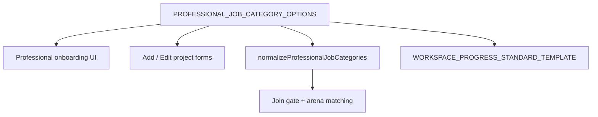

# Split Finance and Accounting into separate skills

## Current state

The canonical preset list in [`lib/professional-onboarding.ts`](lib/professional-onboarding.ts) includes a single combined entry:

```14:14:lib/professional-onboarding.ts
  "Finance / accounting",
```

Everything else reads from this array — no duplicate lists:

- Professional onboarding + profile ([`components/onboarding/professional-onboarding-form.tsx`](components/onboarding/professional-onboarding-form.tsx), [`app/dashboard/profile/page.tsx`](app/dashboard/profile/page.tsx))
- Inventor project create/edit ([`components/dashboard/add-project-form.tsx`](components/dashboard/add-project-form.tsx), [`components/dashboard/edit-project-form.tsx`](components/dashboard/edit-project-form.tsx))
- Join-gate matching ([`lib/skills-match.ts`](lib/skills-match.ts))
- Idea Arena filters/display ([`lib/arena-skill-filter.ts`](lib/arena-skill-filter.ts), [`lib/projects-arena.ts`](lib/projects-arena.ts))

The workspace progress checklist template is keyed by the same strings in [`lib/workspace-progress-checklist.ts`](lib/workspace-progress-checklist.ts) — one combined block today at line 92.



## Changes

### 1. Update canonical preset list — [`lib/professional-onboarding.ts`](lib/professional-onboarding.ts)

Replace `"Finance / accounting"` with two entries in the same position in the array:

- `"Finance"`
- `"Accounting"`

`ProfessionalJobCategory` and `normalizeProfessionalJobCategories` update automatically via the `as const` array. Old `"Finance / accounting"` strings in Clerk metadata or Supabase will be **silently dropped** on read (existing behavior of the allowlist normalizer) — acceptable per your note that existing data does not need preservation.

### 2. Split progress checklist templates — [`lib/workspace-progress-checklist.ts`](lib/workspace-progress-checklist.ts)

Remove the `"Finance / accounting"` key and add two keys with task content split from the current combined template:

**Finance** (modeling, runway, funding, diligence):

| Major | Minors |
|-------|--------|
| Modeling & runway | Build financial model and key assumptions; Review cash runway and funding needs; Support due diligence data room |
| Strategy & reporting | Define KPIs and reporting cadence for investors; Align entity structure with funding plan; Prepare board / investor updates |

**Accounting** (bookkeeping, tax, close):

| Major | Minors |
|-------|--------|
| Bookkeeping & controls | Set up chart of accounts and bookkeeping cadence; Reconcile accounts and manage AP/AR; Establish internal controls |
| Compliance & close | Align tax filings and entity compliance; Close monthly / quarterly books; Support audit and data-room requests |

(Exact minor wording can be tuned during implementation; goal is Finance = forward-looking / capital, Accounting = books / compliance / close.)

The `Record<ProfessionalJobCategory, TemplateMajor[]>` type will enforce that both new keys exist once the preset list is updated.

### 3. Optional cleanup migration (low priority)

Since legacy data is not a concern, **no migration is required** for the app to work. Optionally add a small Supabase migration to scrub stale strings from Postgres arrays/jsonb so admin queries stay clean:

- `projects.required_job_categories`, `completed_job_categories`
- `project_members.covered_job_categories`
- `workspace_progress_checklist` jsonb top-level keys

Example approach: replace `'Finance / accounting'` in text arrays with `'Finance'` and `'Accounting'` (or simply delete the old element). For jsonb, delete the old key — `ensureWorkspaceProgressChecklistSynced` will regenerate templates for newly required categories on next workspace visit.

**Skip** Clerk bulk metadata updates — professionals with the old value will re-pick categories next time they edit their profile.

## Files touched

| File | Change |
|------|--------|
| [`lib/professional-onboarding.ts`](lib/professional-onboarding.ts) | Replace combined preset with `Finance` + `Accounting` |
| [`lib/workspace-progress-checklist.ts`](lib/workspace-progress-checklist.ts) | Two template blocks instead of one |
| `supabase/migrations/009_split_finance_accounting.sql` (optional) | Scrub stale combined string from DB |

No UI component changes — all pickers map over `PROFESSIONAL_JOB_CATEGORY_OPTIONS`.

## Verification

- Professional onboarding and dashboard profile show **Finance** and **Accounting** as separate checkboxes.
- Inventor add/edit project forms show both options independently.
- Selecting only **Finance** on a project does not match a professional who selected only **Accounting** (join gate still requires overlap on at least one preset).
- Workspace Progress tab renders separate checklist sections when a project requires one or both categories.
- Idea Arena category chips and filters reflect the two distinct labels.
