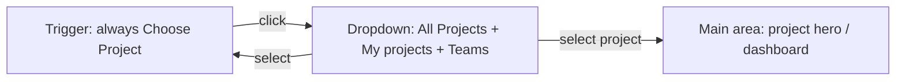

# Static "Choose Project" sidebar trigger

## Goal

The sidebar picker should act as a **launcher**, not a status indicator. The trigger always shows **"Choose Project"**. Project context lives only in the main content area (hero, tabs, etc.) — not repeated in the sidebar button.

No routing, data loading, or shell changes required.

---

## Current behavior (to change)

In [`components/workspace/workspace-project-picker.tsx`](components/workspace/workspace-project-picker.tsx), the trigger reflects the current route:

```237:246:components/workspace/workspace-project-picker.tsx
            {isAllProjects || !activeProject ? (
              <LayoutGrid className="h-5 w-5 shrink-0 opacity-90" aria-hidden />
            ) : (
              <ProjectThumb project={activeProject} />
            )}
            <span className="truncate flex-1 font-medium">
              {isAllProjects || !activeProject
                ? "All Projects"
                : activeProject.title}
            </span>
```

This is what produces the screenshot state ("Lighter Tomorrow..." in the sidebar).

---

## Target behavior



| Element | Behavior |
|---------|----------|
| Trigger label | Always **"Choose Project"** — no title, no thumbnail |
| Trigger icon | Single static icon (e.g. `LayoutGrid`) for affordance |
| Dropdown | Unchanged: **All Projects** (kept per your preference) + grouped project rows with thumbnails |
| Active highlight | Keep `activeProjectId` highlighting inside dropdown rows only |
| After selection | `closeMenu()` + `router.push(...)` — already implemented; trigger stays "Choose Project" |
| Section collapse | Keep existing header collapse toggle + localStorage persistence |

---

## Implementation (single file)

**File:** [`components/workspace/workspace-project-picker.tsx`](components/workspace/workspace-project-picker.tsx)

1. **Simplify trigger content** — replace conditional icon/title block with:
   - Static `LayoutGrid` icon (or similar)
   - Static text `"Choose Project"`
   - Trailing `ChevronDown` (unchanged)

2. **Remove dead code** — delete the `activeProject` `useMemo` and `isAllProjects` variable if they are only used by the trigger. Keep `activeProjectId` prop for dropdown row highlighting.

3. **Accessibility** — optional small improvement: add `aria-label="Choose project"` on the trigger (visible text already covers this; no separate sr-only current-project label needed since we're intentionally hiding it).

No changes to [`components/workspace/workspace-app-shell.tsx`](components/workspace/workspace-app-shell.tsx), pages, or server loaders.

---

## Manual test plan

- On `/workspace`: trigger reads **Choose Project** (not "All Projects")
- On `/workspace/[projectId]`: trigger still reads **Choose Project** (not project title/thumbnail)
- Open dropdown → **All Projects** and grouped projects appear; current route row is highlighted
- Select a project → navigates, main area updates, dropdown closes, trigger unchanged
- Select **All Projects** → navigates to `/workspace`, trigger unchanged
- Section collapse still hides/shows picker body and persists on refresh
