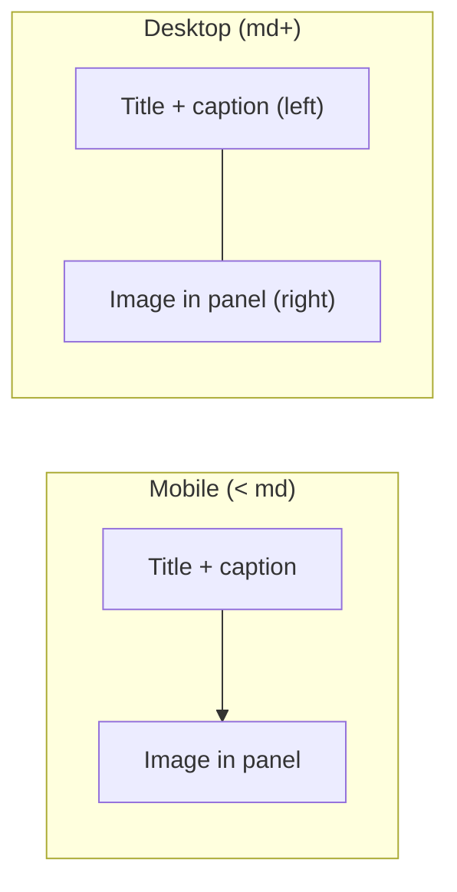

# How It Works — responsive text/image layout

## Current behavior

In [`app/page.tsx`](app/page.tsx), each step is fully stacked:

```167:184:app/page.tsx
                <div className="how-step">
                  <h3 className="how-step-title">{step.title}</h3>
                  <div className="how-step-panel">
                    {step.image && (
                      <Image ... className="how-step-image" />
                    )}
                    {step.caption && (
                      <p className="how-step-caption">{step.caption}</p>
                    )}
                  </div>
                </div>
```

Order today: **title → image → caption** (caption lives inside the periwinkle panel below the image). Styles in [`app/globals.css`](app/globals.css) center all text (`.how-step-title`, `.how-step-caption`).

The Inventors and Professionals sections already use the desired responsive pattern: `grid md:grid-cols-2 gap-12 items-center` with text left / image right on desktop.

## Target layout

| Breakpoint | Layout |
|------------|--------|
| **Narrow** (`< md`, &lt;768px) | Title + caption stacked on top, image below |
| **Desktop** (`md+`) | Text column on the **left**, image column on the **right** |

The green **Yes!** badges between steps stay centered and unchanged.



## Implementation

### 1. Restructure step markup — [`app/page.tsx`](app/page.tsx)

- Widen the section container from `max-w-4xl` to `max-w-5xl` (matches Inventors/Professionals and gives room for side-by-side content).
- Change each `.how-step` to a responsive grid:

```tsx
<div className="how-step grid md:grid-cols-2 gap-6 md:gap-12 items-center">
  <div className="how-step-text">
    <h3 className="how-step-title">{step.title}</h3>
    {step.caption && <p className="how-step-caption">{step.caption}</p>}
  </div>
  {step.image && (
    <div className="how-step-panel">
      <Image ... className="how-step-image" />
    </div>
  )}
</div>
```

- Move caption out of the panel into the text column so all copy groups together above the image on mobile and sits on the left on desktop.
- Steps without a caption (1, 5, 6, 7) simply show the title in the left/top text block.

### 2. Update styles — [`app/globals.css`](app/globals.css)

Adjust existing `.how-step-*` classes (no new files):

| Class | Change |
|-------|--------|
| `.how-step-title` | Remove always-centered text; use `text-center md:text-left`, keep `mb-4` (or `mb-2` when caption follows) |
| `.how-step-caption` | Remove `mt-4` (was spacing below image); use `text-center md:text-left`, add `mt-2 md:mt-3` for spacing under title |
| `.how-step-panel` | Unchanged visually — still periwinkle rounded panel, now wraps **image only** |
| `.how-step-image` | Keep sizing; drop `mx-auto` on desktop if needed so image aligns naturally in the right column (`mx-auto md:mx-0` or `md:ml-auto` for right-column alignment) |

Optional: add `.how-step-text` with `order-1` and `.how-step-panel` with `order-2` explicitly (default grid order already achieves text-then-image on mobile).

### 3. Breakpoint choice

Use **`md:` (768px)** — same breakpoint as the Inventors/Professionals sections, so layout behavior is consistent across the landing page.

## Files touched

- [`app/page.tsx`](app/page.tsx) — step JSX restructure + section width
- [`app/globals.css`](app/globals.css) — responsive text alignment and caption spacing

## Verification

- **Desktop (≥768px):** each step shows title (+ caption if present) left-aligned on the left; periwinkle panel with image on the right; vertical spacing between steps unchanged.
- **Mobile (&lt;768px):** title and caption centered/stacked on top; image panel below; Yes! badges still centered between gated steps.
- **All 7 steps:** confirm steps with and without captions render correctly; images still respect `max-h` constraints and don't overflow horizontally.
