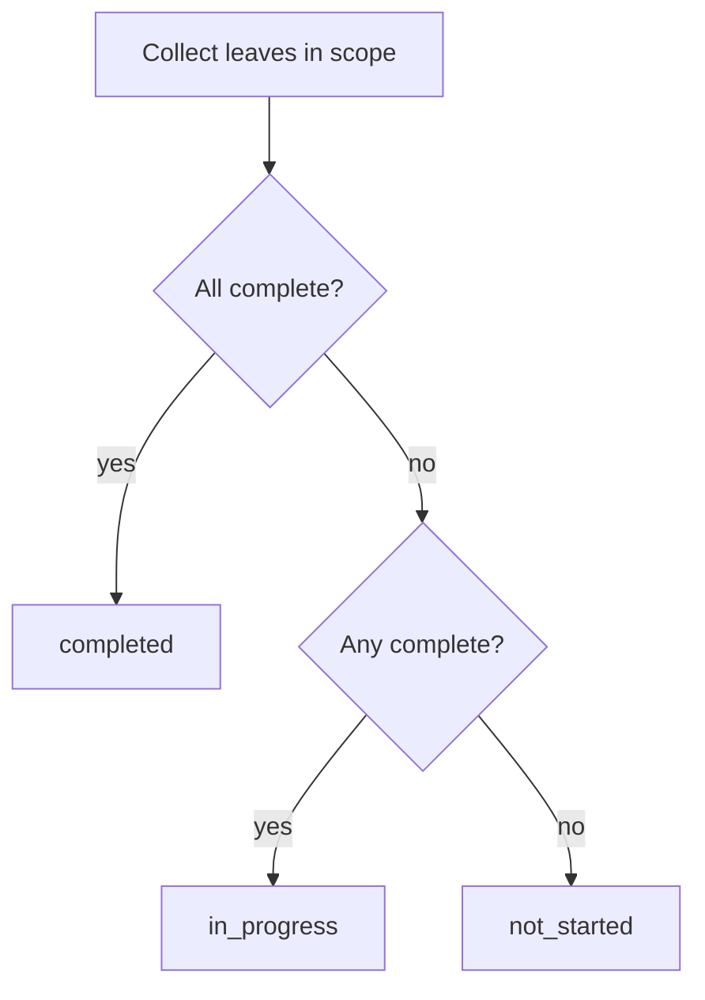

# Task list and task status symbols

## Problem

In the workspace Progress panel ([`components/workspace/workspace-progress-panel.tsx`](components/workspace/workspace-progress-panel.tsx)), collapsed rows hide completion state:

- **Task lists** (e.g. “Discovery & strategy”) show only chevron + title when closed — no indication of progress inside.
- **Tasks with 2+ subtasks** ([`components/workspace/progress-task-row.tsx`](components/workspace/progress-task-row.tsx)) omit the header checkbox (`headerCheckboxLeaf` returns `null`), so when collapsed you cannot see if any subtasks are done.

Skill-level rows already show a badge + `X / Y subtasks done`; this change adds the same mental model one level down.

## Status rules

Reuse the same leaf semantics as arena/skill status ([`collectLeavesForCategory`](lib/workspace-progress-checklist.ts)):

| Status | Condition |
|--------|-----------|
| **Completed** | All leaves in scope are checked |
| **In progress** | At least one leaf checked, but not all |
| **Not started** | Zero leaves checked (including empty scope: no tasks / no subtasks) |

**Leaf scope per level** (matches existing `collectLeavesForCategory` logic):

- **Task list**: all leaves under every task in that list (tasks with no subtasks count as a single leaf via `task.completed`).
- **Task**: that task’s subtasks, or the task itself if it has no subtasks.

No team-coverage dimension at these levels — only checklist completion.



## Implementation

### 1. Shared derivation helpers — [`lib/workspace-progress-checklist.ts`](lib/workspace-progress-checklist.ts)

Add a small exported type and helpers (keeps UI thin, mirrors `categoryAllLeavesComplete` / `categoryHasAnyLeafCompleted`):

```ts
export type ProgressItemStatus = "not_started" | "in_progress" | "completed";

export function collectLeavesForTaskList(taskList: WorkspaceProgressTaskList): WorkspaceProgressLeaf[]
export function collectLeavesForTask(task: WorkspaceProgressTask): WorkspaceProgressLeaf[]
export function deriveProgressItemStatus(leaves: WorkspaceProgressLeaf[]): ProgressItemStatus
export function deriveTaskListStatus(taskList: WorkspaceProgressTaskList): ProgressItemStatus
export function deriveTaskStatus(task: WorkspaceProgressTask): ProgressItemStatus
```

Implement `collectLeavesForTaskList` / `collectLeavesForTask` by extracting the inner loops already in `collectLeavesForCategory` (no behavior change, just scoped collectors).

### 2. Shared icon component — new [`components/workspace/progress-status-icon.tsx`](components/workspace/progress-status-icon.tsx)

Small presentational component, colors aligned with existing skill badges in the same panel (`slotBadge` / arena UI):

| Status | Icon (lucide-react) | Color |
|--------|---------------------|-------|
| Not started | `Circle` (outline) | amber (`text-amber-500`) |
| In progress | `CircleDot` | sky (`text-sky-600`) |
| Completed | `CheckCircle2` | emerald (`text-emerald-600`) |

- Fixed `h-4 w-4 shrink-0`
- `aria-hidden` on the icon; parent control gets `aria-label` including status text (e.g. `"Discovery & strategy, in progress"`)

### 3. Task list headers — [`components/workspace/workspace-progress-panel.tsx`](components/workspace/workspace-progress-panel.tsx)

In the task list toggle button (~lines 426–437), insert `<ProgressStatusIcon status={deriveTaskListStatus(taskList)} />` **before** the chevron.

Update the expand button’s accessible name to include status when collapsed matters most; e.g. extend `aria-label` on the button.

### 4. Task rows — [`components/workspace/progress-task-row.tsx`](components/workspace/progress-task-row.tsx)

Show `<ProgressStatusIcon />` only when `task.subtasks.length > 1` (the case with no header checkbox):

- Place icon before the chevron in the task toggle button
- Include status in the task button’s accessible label

**Do not** add the icon when a header checkbox already communicates state (0 or 1 subtask) — avoids duplicate controls.

## Files touched

| File | Change |
|------|--------|
| [`lib/workspace-progress-checklist.ts`](lib/workspace-progress-checklist.ts) | Leaf collectors + status derivation |
| [`components/workspace/progress-status-icon.tsx`](components/workspace/progress-status-icon.tsx) | New icon component |
| [`components/workspace/workspace-progress-panel.tsx`](components/workspace/workspace-progress-panel.tsx) | Icon on every task list header |
| [`components/workspace/progress-task-row.tsx`](components/workspace/progress-task-row.tsx) | Icon on multi-subtask task headers |

No server actions, migrations, or arena sync changes — purely derived UI from existing checklist JSON.

## Verification

Manual checks in workspace Progress:

1. Collapse a task list with mixed subtask completion → sky dot; all done → green check; none done → amber circle.
2. Collapse a multi-subtask task → same three states reflect that task’s subtasks only.
3. Task with 0 or 1 subtask → checkbox still shown, no extra icon.
4. Toggle subtasks → icon updates immediately (optimistic `localChecklist` already drives re-renders).
5. Screen reader: expand buttons announce status in label.
