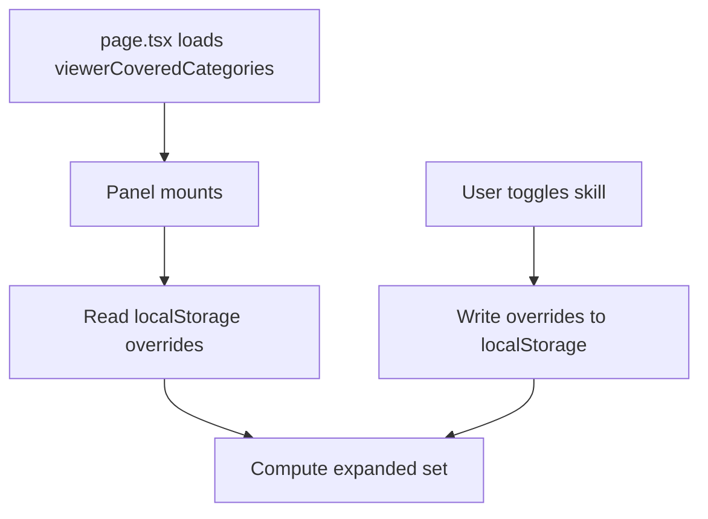

# User-first skill expand defaults

## Goal

When a user opens **Files** or **Progress**, skill accordions should start with **their** categories open and **everyone else's** closed. If they manually open a non-their skill (or close one of theirs), remember that preference for future visits—**shared** between Files and Progress for the same project.

## Current behavior

| Tab | Default expand state | Viewer skills used? |
|-----|---------------------|---------------------|
| [workspace-progress-panel.tsx](components/workspace/workspace-progress-panel.tsx) | All skills expanded | No |
| [workspace-files-panel.tsx](components/workspace/workspace-files-panel.tsx) | All skills collapsed | No |

Both use ephemeral `useState<Set<string>>` with no persistence. `currentUserId` is only passed to Files (for delete permissions); Progress does not receive it.

## Target behavior



**Default expanded** = categories in `viewerCoveredCategories` (intersected with the project's required categories).

**Persisted overrides** (delta model, stored in `localStorage`):

- `manuallyOpened`: non-user skills the viewer opened
- `manuallyClosed`: user skills the viewer closed

**Effective expanded** = `(userSkills − manuallyClosed) ∪ manuallyOpened`, filtered to valid project categories.

On toggle:
- User skill, currently open → add to `manuallyClosed`
- User skill, currently closed → remove from `manuallyClosed`
- Other skill, currently closed → add to `manuallyOpened`
- Other skill, currently open → remove from `manuallyOpened`

**Storage key** (shared across Files + Progress):

```
ven-shares:workspace-skill-expand:{projectId}:{userId}
```

Value shape:

```ts
{ manuallyOpened: string[]; manuallyClosed: string[] }
```

Use a `useEffect` on mount to hydrate from `localStorage` (avoid SSR mismatch). Guard `typeof window !== "undefined"`.

---

## 1. Resolve viewer's skills on the server

**File:** [app/idea-arena/[projectId]/workspace/page.tsx](app/idea-arena/[projectId]/workspace/page.tsx)

Today only `categoryCoverage` is taken from `getArenaTeamDisplay`. Also destructure `members`:

```ts
const { members, categoryCoverage } = await getArenaTeamDisplay(...);
```

Add a small pure helper in [lib/arena-team.ts](lib/arena-team.ts) (or a dedicated `lib/workspace-viewer-skills.ts`):

```ts
export function resolveViewerCoveredCategories(
  currentUserId: string,
  members: ArenaTeamMemberDisplay[],
  requiredCategories: ProfessionalJobCategory[],
  profileCategories: ProfessionalJobCategory[] = [],
): ProfessionalJobCategory[] {
  const member = members.find((m) => m.clerkUserId === currentUserId);
  if (member) return member.coveredCategories;
  return intersectProfessionalWithRequiredCategories(profileCategories, requiredCategories);
}
```

**Owner fallback:** project owners are usually **not** in `project_members`. When the viewer is not found in `members`, fall back to Clerk profile skills (same source as join flow):

```ts
import { currentUser } from "@clerk/nextjs/server";
import { getProfessionalJobCategoriesFromMetadata } from "@/lib/skills-match";

const profileSkills = getProfessionalJobCategoriesFromMetadata(
  (await currentUser())?.publicMetadata as Record<string, unknown>,
);

const viewerCoveredCategories = resolveViewerCoveredCategories(
  userId,
  members,
  arenaProject.required_job_categories,
  profileSkills,
);
```

Pass `viewerCoveredCategories` through [workspace-shell.tsx](components/workspace/workspace-shell.tsx) to both panels.

**Edge cases:**
- Viewer with **no** matching skills → all skill sections collapsed (correct)
- Project adds a new required category later → new categories use default (open if user covers them) unless explicitly in overrides
- Invalid/stale categories in localStorage → filter against `categoryStatuses.map(s => s.category)`

---

## 2. Shared client hook

**New file:** `lib/use-workspace-skill-expand.ts` (client module; colocate pure helpers in same file or `lib/workspace-skill-expand.ts`)

```ts
export function useWorkspaceSkillExpand({
  projectId,
  userId,
  userSkills,
  allCategories,
}: {
  projectId: string;
  userId: string;
  userSkills: string[];
  allCategories: string[];
}): { expandedSkills: Set<string>; toggleSkill: (category: string) => void }
```

Implementation outline:
1. `userSkillSet = new Set(userSkills)`
2. On mount: read overrides from localStorage; compute initial `expandedSkills`
3. `toggleSkill`: update overrides + `expandedSkills`; persist to localStorage
4. Memoize storage key from `projectId` + `userId`

Both panels replace their local `expandedSkills` / `toggleSkill` with this hook.

---

## 3. Wire into panels

### [workspace-progress-panel.tsx](components/workspace/workspace-progress-panel.tsx)

- Add props: `currentUserId: string`, `viewerCoveredCategories: ProfessionalJobCategory[]`
- Replace lines ~572–602:

```ts
// Before
const [expandedSkills, setExpandedSkills] = useState<Set<string>>(
  () => new Set(categoryStatuses.map((s) => s.category)),
);

// After
const { expandedSkills, toggleSkill } = useWorkspaceSkillExpand({
  projectId,
  userId: currentUserId,
  userSkills: viewerCoveredCategories,
  allCategories: categoryStatuses.map((s) => s.category),
});
```

Task-list and task expand state stays unchanged (collapsed by default).

### [workspace-files-panel.tsx](components/workspace/workspace-files-panel.tsx)

- Add prop: `viewerCoveredCategories: ProfessionalJobCategory[]` (`currentUserId` already present)
- Same hook replacement for skill sections (~364–399)
- "General project files" and "Removed files" sections unchanged

### [workspace-shell.tsx](components/workspace/workspace-shell.tsx)

- Extend `WorkspaceShellProps` with `viewerCoveredCategories: ProfessionalJobCategory[]`
- Pass to `WorkspaceFilesPanel` and `WorkspaceProgressPanel`

---

## 4. Compatibility with Organizer merge

The in-progress [organizer plan](.cursor/plans/organizer_skill_files_44424797.plan.md) consolidates Files into a single Organizer tab. This hook is tab-agnostic (key is per project + user), so the same logic applies when that panel lands—only one consumer instead of two.

---

## Manual verification

1. **Professional with 1–2 skills** — only those skill headers expanded on first Files visit; others collapsed
2. **Switch to Progress** — same expand state (shared memory)
3. **Open a non-user skill** — stays open after refresh and tab switch
4. **Close a user skill** — stays closed after refresh
5. **Owner with profile skills, not in `project_members`** — their profile skills expand (fallback)
6. **Owner/member with no skills** — all skill sections collapsed
7. **Project with zero required categories** — no regressions
8. **Task/subtask expand** — still independent; only skill-level accordions affected

## Files to touch

| File | Change |
|------|--------|
| [lib/arena-team.ts](lib/arena-team.ts) | Add `resolveViewerCoveredCategories` |
| `lib/use-workspace-skill-expand.ts` | **New** — hook + localStorage helpers |
| [app/idea-arena/.../workspace/page.tsx](app/idea-arena/[projectId]/workspace/page.tsx) | Compute + pass `viewerCoveredCategories` |
| [components/workspace/workspace-shell.tsx](components/workspace/workspace-shell.tsx) | Thread new prop |
| [components/workspace/workspace-progress-panel.tsx](components/workspace/workspace-progress-panel.tsx) | Use hook; accept new props |
| [components/workspace/workspace-files-panel.tsx](components/workspace/workspace-files-panel.tsx) | Use hook; accept new prop |
