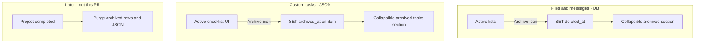

# Workspace archive instead of delete

## Current state

| Area | Retention today | UI today | Gap |
|------|-----------------|----------|-----|
| **Files** | [`softDeleteWorkspaceFile`](lib/workspace.ts) sets `deleted_at` on `project_workspace_files` | “Remove” + collapsible **Removed files** in [`workspace-files-panel.tsx`](components/workspace/workspace-files-panel.tsx) and [`organizer-skill-files.tsx`](components/workspace/organizer-skill-files.tsx) | Naming only; behavior is already archive-like |
| **Messages** | [`softDeleteWorkspaceMessage`](lib/workspace.ts) sets `deleted_at` on `project_workspace_messages` ([`013_workspace_message_skill_urgent_delete.sql`](supabase/migrations/013_workspace_message_skill_urgent_delete.sql)) | “Delete” / “Remove” and copy says **“deleted permanently”** ([`workspace-messages-panel.tsx`](components/workspace/workspace-messages-panel.tsx) ~304) | Misleading copy; archived messages are **not listed anywhere** ([`listWorkspaceMessages`](lib/workspace.ts) filters `.is("deleted_at", null)`) |
| **Custom tasks** | [`deleteCustomProgressItem`](lib/workspace-progress-checklist.ts) **splices** items out of `projects.workspace_progress_checklist` JSON | “Remove” in [`progress-task-row.tsx`](components/workspace/progress-task-row.tsx) and [`workspace-progress-panel.tsx`](components/workspace/workspace-progress-panel.tsx) | True data loss; not retained until project end |

Post-project purge is explicitly **out of scope** (no completion hook yet).



## Design decisions

1. **Keep `deleted_at` / `deleted_by_clerk_user_id` in Postgres** — no migration rename; user-facing language is “archive” only.
2. **Keep activity kinds** `message_deleted` / `file_deleted` internally; change **display strings** in [`workspace-shell.tsx`](components/workspace/workspace-shell.tsx) `activityDescription` to “Archived …”.
3. **Shared archive control** — one small client component for icon + confirm + pending state so Messages, Files, and Progress stay consistent.
4. **Archived items excluded from completion** — when filtering active checklist leaves, skip any item with `archived_at` set so arena `completed_job_categories` does not depend on archived custom work.
5. **No unarchive / no project-end purge** in this change.

---

## 1. Shared UI: `Archive` icon control

Add [`components/workspace/workspace-archive-control.tsx`](components/workspace/workspace-archive-control.tsx):

- Import `Archive` from `lucide-react`.
- **Trigger**: icon-only button, `aria-label="Archive"`, neutral slate hover (not red).
- **Confirm**: inline or small row — e.g. “Archive this message? It will leave the board but stay until the project ends.” Confirm button label **“Archive”** / pending **“Archiving…”** (slate styling, not destructive red).
- Props: `confirmMessage`, `pending`, `onCancel`, `onConfirm`.

Replace duplicated confirm blocks in:

- [`workspace-messages-panel.tsx`](components/workspace/workspace-messages-panel.tsx)
- [`workspace-files-panel.tsx`](components/workspace/workspace-files-panel.tsx) (`WorkspaceFileRowActions`)
- [`organizer-skill-files.tsx`](components/workspace/organizer-skill-files.tsx)
- [`progress-task-row.tsx`](components/workspace/progress-task-row.tsx) (`RemoveConfirm` → use shared control)
- [`workspace-progress-panel.tsx`](components/workspace/workspace-progress-panel.tsx) (task list confirm)

Rename local state where helpful (`pendingDeleteId` → `pendingArchiveId`, etc.) for clarity; server function names can stay to limit diff size.

---

## 2. Messages: copy, icon, archived section

### Server — [`lib/workspace.ts`](lib/workspace.ts)

- Add `listArchivedWorkspaceMessages(projectId, limit?)` — same shape as active list but `.not("deleted_at", "is", null)` ordered `created_at desc`.
- Update user-facing errors in `softDeleteWorkspaceMessage` (“already archived”, “could not archive”).
- Optionally alias export `archiveWorkspaceMessage = softDeleteWorkspaceMessage` (call sites can keep `actionDeleteWorkspaceMessage` or rename action to `actionArchiveWorkspaceMessage` — prefer **rename action + thin alias** for new code clarity).

### Page — [`app/idea-arena/[projectId]/workspace/page.tsx`](app/idea-arena/[projectId]/workspace/page.tsx)

- `Promise.all` also loads archived messages.
- Extend `WorkspaceMessageDTO` in [`workspace-shell.tsx`](components/workspace/workspace-shell.tsx) with optional `deleted_at`, `deleted_by_clerk_user_id` for archived rows only (or a separate `archivedMessages` prop).
- Resolve `deleted_by` names in `nameMap` like files.

### Panel — [`workspace-messages-panel.tsx`](components/workspace/workspace-messages-panel.tsx)

- Replace text **Delete** / **Remove** with `WorkspaceArchiveControl`.
- Fix confirm copy (remove “permanently”).
- Below the active thread, per current board: collapsible **“Archived messages (N)”** — read-only cards (author, time, body snippet, “Archived by …”).
- `boardMessages` stays active-only; `archivedBoardMessages` filtered with `messagesMatchBoard`.

Replies to archived parents already blocked in [`postWorkspaceMessage`](lib/workspace.ts) (`parent.deleted_at`).

---

## 3. Files: rename “Removed” → “Archived”

In [`workspace-files-panel.tsx`](components/workspace/workspace-files-panel.tsx) and [`organizer-skill-files.tsx`](components/workspace/organizer-skill-files.tsx):

- Section titles: **Archived files** / **Archived uncategorized**.
- Metadata: **Archived by** (not “Removed by”).
- Confirm: “Archive this file? It will move to archived files.”
- File row badge **Archived** instead of **Removed**.
- Swap text Remove buttons for `WorkspaceArchiveControl`.

Server errors in `softDeleteWorkspaceFile` → archive wording; activity feed string in `workspace-shell.tsx`.

---

## 4. Custom progress tasks: soft archive in JSON

### Types and parsing — [`lib/workspace-progress-checklist.ts`](lib/workspace-progress-checklist.ts)

Add optional field on custom items only (parsed if present, omitted on standard template rows):

```ts
archived_at?: string | null; // ISO timestamp
```

Update `parseSubtask`, `parseTask`, `parseTaskList` to read `archived_at` when string.

### Lib behavior

- Replace `deleteCustomProgressItem` with **`archiveCustomProgressItem`** (keep old name as deprecated alias calling archive, or rename and update single import in [`actions.ts`](app/idea-arena/[projectId]/workspace/actions.ts)).
- For `taskList` / `task` / `subtask`: if `standard` → `null`; else set `archived_at = new Date().toISOString()` (idempotent if already archived).
- Add helpers: `isArchived(item)`, `filterActiveTaskLists(block)` for UI.
- Update leaf collectors used for **status and completion** (`collectLeavesForTask`, `collectLeavesForTaskList`, `collectLeavesForCategory`, and any drag/reorder paths) to **skip archived** children/lists/tasks.

### Server action

- Rename `actionProgressDeleteCustomItem` → **`actionProgressArchiveCustomItem`** (same auth + `persistWorkspaceProgress` flow).
- Error: “That item cannot be archived.”

### UI — [`workspace-progress-panel.tsx`](components/workspace/workspace-progress-panel.tsx) + [`progress-task-row.tsx`](components/workspace/progress-task-row.tsx)

- Main lists render **non-archived** items only.
- Collapsible **“Archived tasks (N)”** at bottom of each skill’s Progress tab: show archived custom task lists / tasks / subtasks (titles + archived date; no checkbox/drag).
- Archive icon on custom rows only (`!standard`); rename handlers `onRequestArchive` / `onConfirmArchive`.

---

## 5. Activity feed and server messages

[`workspace-shell.tsx`](components/workspace/workspace-shell.tsx):

| Kind | New label |
|------|-----------|
| `message_deleted` | Archived a message … |
| `file_deleted` | Archived {filename} … |

[`app/idea-arena/[projectId]/workspace/actions.ts`](app/idea-arena/[projectId]/workspace/actions.ts): return strings like “Message archived.” instead of “removed/deleted” where user-visible.

---

## 6. Manual verification

- Archive a message: leaves board, appears under **Archived messages**, activity says archived; reply to archived message still rejected.
- Archive a file: active list hides it; **Archived files** still allows download.
- Archive custom task / subtask / task list: leaves active Progress UI, appears in archived section; skill completion unchanged if archived items were incomplete.
- Standard template rows: no archive control; server rejects forced archive.
- Icons: only `Archive` icon visible on rows (no “Remove”/“Delete” text on workspace surfaces).

---

## Out of scope (later)

- Hard purge when project status = completed.
- Restore / unarchive.
- DB column rename `deleted_at` → `archived_at`.
- Renaming [`components/dashboard/project-required-skill-rows.tsx`](components/dashboard/project-required-skill-rows.tsx) “Remove” (different feature).
