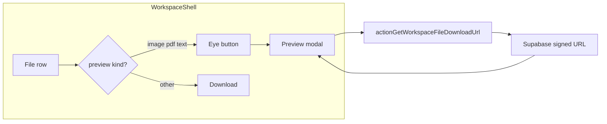

# Workspace Files: preview icon and in-app preview

## Context- Files UI lives in [`components/workspace/workspace-shell.tsx`](components/workspace/workspace-shell.tsx): each row has metadata + **Download**; it already calls [`actionGetWorkspaceFileDownloadUrl`](app/idea-arena/[projectId]/workspace/actions.ts) to open a short-lived Supabase signed URL.
- Allowed uploads (same file as preview allowlist source of truth) are defined in [`app/idea-arena/[projectId]/workspace/actions.ts`](app/idea-arena/[projectId]/workspace/actions.ts): `image/*`, `application/pdf`, `text/plain`, `text/csv`, zip, and Office types.
- DTOs already include `content_type` and `byte_size` ([`WorkspaceFileDTO`](components/workspace/workspace-shell.tsx)), so the client can decide preview eligibility without extra API calls.

## Best practice (what “good” looks like)

1. **Only advertise preview when it works** — Show a preview affordance (e.g. Lucide `Eye`) only for types you can render reliably in the browser. For **Word, Excel, and ZIP**, do **not** show preview: native in-browser preview is poor or unsafe without a dedicated pipeline (server extract, or third-party viewers that often require public URLs and have privacy tradeoffs).
2. **Same trust model as download** — Reuse the **existing** authenticated server action to mint signed URLs; do not expose public bucket URLs. Keep URLs short-lived (current **120s** is fine for opening a modal; if users report expiry while reading long PDFs, bump TTL slightly or re-fetch the URL on load failure).
3. **Prefer native rendering** — **Images**: ``. **PDF**: `<iframe title={...} src={url} />` (browser PDF UI). **Text/CSV**: `fetch(url)` + `<pre>` with `whitespace-pre-wrap` (no new PDF.js dependency unless you later need advanced PDF features).
4. **MIME + filename fallback** — `content_type` may be null or wrong; add a small helper (e.g. [`lib/workspace-preview.ts`](lib/workspace-preview.ts)) that resolves preview kind from **MIME first**, then **extension** (e.g. `.pdf`, `.png`, `.csv`, `.txt`).
5. **Guardrails for text** — Cap preview size (e.g. first **256–512 KB** or use `byte_size` to skip fetch above a threshold) with a message to use Download for the full file. Prevents locking the main thread on huge CSVs.
6. **Accessibility and UX** — Modal: `role="dialog"`, `aria-modal`, labelled by filename, **Escape** closes, focus return to trigger; preview button `aria-label` includes filename. Show loading and error states if the signed URL fails or fetch errors (CORS/network).
7. **CORS** — Supabase signed URLs usually allow browser `fetch` from your app origin; verify once in dev for text previews. If blocked, fallback copy: “Open in new tab” using the same signed URL (same as today’s download flow behavior).

## Implementation outline

| Piece | Action |
|--------|--------|
| **`lib/workspace-preview.ts`** | Export `getWorkspacePreviewKind(file: { content_type, filename })` → `'image' \| 'pdf' \| 'text' \| null` and optional `MAX_TEXT_PREVIEW_BYTES`. |
| **`workspace-shell.tsx`** | For each file row: if `getWorkspacePreviewKind(...)`, render an icon button next to Download; otherwise no preview control. |
| **Preview modal** | Local state: `previewTarget: WorkspaceFileDTO \| null`. On open: call `actionGetWorkspaceFileDownloadUrl`, then branch by kind (image / iframe PDF / fetch text). Close clears URL state. |
| **No server action changes required** unless you extend signed URL TTL or add a dedicated preview action (optional; not required if reusing download URL). |

## Optional later enhancements (out of scope unless you want them)

- **Next.js `<Image>`** for previews: signed Supabase URLs are not in [`next.config.ts`](next.config.ts) `images.remotePatterns` for the sign path; plain `` avoids config churn.
- **Dedicated preview route (proxy)** — Only if you need to hide the storage URL from the network tab; same auth complexity as download, rarely necessary for private signed URLs.

