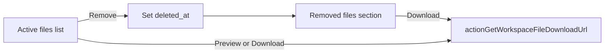

# Workspace file soft delete with deprecated area

## Context

Workspace attachments live in Supabase table `project_workspace_files` ([`006_project_workspace.sql`](supabase/migrations/006_project_workspace.sql)), uploaded via [`actionUploadWorkspaceFile`](app/idea-arena/[projectId]/workspace/actions.ts), and listed in the Files tab of [`workspace-shell.tsx`](components/workspace/workspace-shell.tsx). There is **no delete flow today** — files are permanent until the whole project is deleted.

Confirmed preferences:
- **Who can remove:** uploader **or** project owner
- **Deprecated area:** metadata + download only (no preview)

## Approach: soft delete (keep storage blob)

Do **not** delete the Storage object. Set DB columns so the file leaves the active list but remains downloadable from the deprecated section. This matches the "polished deprecated files area" request and preserves audit history.



## 1. Database migration

Add [`supabase/migrations/010_workspace_file_soft_delete.sql`](supabase/migrations/010_workspace_file_soft_delete.sql):

```sql
alter table public.project_workspace_files
  add column if not exists deleted_at timestamptz,
  add column if not exists deleted_by_clerk_user_id text;

create index if not exists project_workspace_files_project_active_idx
  on public.project_workspace_files (project_id, created_at desc)
  where deleted_at is null;
```

No RLS policy changes needed — the app already uses the service-role client ([`lib/supabase-server.ts`](lib/supabase-server.ts)); authorization stays in server actions.

## 2. Server layer

### Types and helpers — [`lib/workspace.ts`](lib/workspace.ts)

Extend `WorkspaceFileRow`:

```ts
deleted_at: string | null;
deleted_by_clerk_user_id: string | null;
```

Add `softDeleteWorkspaceFile(projectId, fileId, deletedByClerkUserId)`:
- `UPDATE project_workspace_files SET deleted_at = now(), deleted_by_clerk_user_id = $user WHERE id = $fileId AND project_id = $projectId AND deleted_at IS NULL`
- On success, insert activity `kind = 'file_deleted'` with payload `{ file_id, filename }`
- Return `{ ok: true } | { ok: false; error: string }`

`listWorkspaceFiles` stays a single query (all rows, active + removed) ordered by `created_at desc`.

### Server action — [`app/idea-arena/[projectId]/workspace/actions.ts`](app/idea-arena/[projectId]/workspace/actions.ts)

Add `actionDeleteWorkspaceFile(projectId, fileId)`:

1. Auth + `canAccessWorkspace`
2. Load file row via `getWorkspaceFileById`
3. Reject if missing or already deleted
4. Permission check: `userId === row.uploaded_by_clerk_user_id` **OR** `userId === project.clerk_user_id` (reuse `getWorkspaceProjectMeta`)
5. Call `softDeleteWorkspaceFile`
6. `revalidatePath(workspacePath(projectId))`

`actionGetWorkspaceFileDownloadUrl` — **no change**; deleted files remain downloadable (required for deprecated area).

## 3. Page data — [`app/idea-arena/[projectId]/workspace/page.tsx`](app/idea-arena/[projectId]/workspace/page.tsx)

Extend `WorkspaceFileDTO` mapping with `deleted_at` and `deleted_by_clerk_user_id`.

Add `deleted_by_clerk_user_id` values to the `allIds` set for name resolution.

Pass `isProjectOwner` is already available — reuse for delete-button visibility alongside uploader check.

## 4. Files tab UI — [`components/workspace/workspace-shell.tsx`](components/workspace/workspace-shell.tsx)

### DTO

```ts
export type WorkspaceFileDTO = {
  // existing fields...
  deleted_at: string | null;
  deleted_by_clerk_user_id: string | null;
};
```

Split in component:

- `activeFiles = files.filter(f => !f.deleted_at)`
- `deprecatedFiles = files.filter(f => f.deleted_at)`

### Active files list (current list, refined)

- Empty state when `activeFiles.length === 0` (even if deprecated files exist): *"No active files."*
- Each row keeps Preview + Download
- **Remove** control when `!f.deleted_at && (f.uploaded_by_clerk_user_id === currentUserId || isProjectOwner)`
- Inline confirm (local state `pendingDeleteId`): clicking Remove shows a small confirm row (*"Remove this file? It will move to Removed files."* + Cancel / Remove buttons) — no `window.confirm`, consistent with existing inline error patterns
- On confirm: call `actionDeleteWorkspaceFile`, show error inline, `router.refresh()` on success

### Removed files section (new, below active list)

Only render when `deprecatedFiles.length > 0`.

- Collapsible block, **collapsed by default**; header: **"Removed files (N)"** with chevron toggle
- Muted styling: `text-slate-500`, lighter row background, optional subtle "Removed" label
- Metadata line: `{filename}` · removed by `{nameMap[deleted_by]}` · `{formatTime(deleted_at)}`
- **Download only** — no Eye/preview button
- Original uploader + size + upload date can appear as secondary text if helpful

### Activity feed

Extend `activityDescription()`:

```ts
if (kind === "file_deleted") {
  const name = typeof payload?.filename === "string" ? payload.filename : "a file";
  return `Removed ${name}`;
}
```

## 5. Files touched

| File | Change |
|------|--------|
| `supabase/migrations/010_workspace_file_soft_delete.sql` | New columns + partial index |
| `lib/workspace.ts` | Types, `softDeleteWorkspaceFile` |
| `app/idea-arena/.../workspace/actions.ts` | `actionDeleteWorkspaceFile` |
| `app/idea-arena/.../workspace/page.tsx` | Map new DTO fields, resolve deleter names |
| `components/workspace/workspace-shell.tsx` | Remove flow, deprecated section, activity text |

## Out of scope (future)

- Restore / undelete
- Hard delete + Storage cleanup
- Owner-only purge of deprecated files

## Verification

1. **Uploader removes own file** — leaves active list, appears in collapsed Removed files; Activity shows "Removed {name}"; download works from deprecated section; preview unavailable there.
2. **Project owner removes someone else's file** — same behavior.
3. **Non-owner, non-uploader** — no Remove button visible.
4. **Already removed file** — delete action returns error; no duplicate removal.
5. **Empty active + deprecated exists** — active area shows "No active files"; Removed section still visible with count.
6. Apply migration to Supabase (local or remote) before testing.
