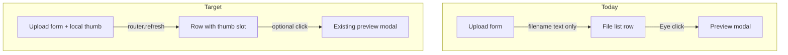

# Workspace file auto-thumbnails

## Goal

When a user uploads a workspace file, they should **see a thumbnail without clicking Preview** — in the file list after upload and while selecting a file before submit. Scope (per your choice): **images + PDF first page** in the workspace Files UI ([`workspace-files-panel.tsx`](components/workspace/workspace-files-panel.tsx), [`organizer-skill-files.tsx`](components/workspace/organizer-skill-files.tsx)). Other types (Word, Excel, ZIP) keep a neutral file-type icon in the same slot.

## Current state

- Rows are text-only (filename, metadata, Eye / Download / Remove) — see [`WorkspaceFileRow`](components/workspace/workspace-files-panel.tsx) and duplicate [`FileRow`](components/workspace/organizer-skill-files.tsx).
- Preview kind detection already exists in [`lib/workspace-preview.ts`](lib/workspace-preview.ts) (`image` | `pdf` | `text`).
- Files live in a **private** bucket; [`actionGetWorkspaceFileDownloadUrl`](app/idea-arena/[projectId]/workspace/actions.ts) mints **120s** signed URLs after `assertWorkspaceAccess`.
- Upload flows only show the **filename string** after “Choose file” — no visual preview.



## Recommended approach

### 1. Shared thumbnail UI

Add [`components/workspace/workspace-file-thumbnail.tsx`](components/workspace/workspace-file-thumbnail.tsx) (client):

| Preview kind | Thumbnail behavior |
|--------------|------------------|
| `image` | Fetch display signed URL → `` in fixed box (`h-12 w-12` or `h-14 w-14`, `object-cover`, `rounded-lg`, `border`) |
| `pdf` | Lazy-load `pdfjs-dist` (dynamic `import()`), fetch signed URL as `ArrayBuffer`, render **page 1** to offscreen canvas → `data:` or canvas in box |
| `null` | Lucide `File` / `FileText` icon placeholder (same dimensions) |

Props: `projectId`, `fileId`, `filename`, `content_type`, `byte_size` (reuse `getWorkspacePreviewKind`).

States: skeleton while loading, icon fallback on error, `aria-hidden` on decorative thumb; filename stays the accessible name on the row.

### 2. Longer-lived signed URLs for inline display

Extend [`actionGetWorkspaceFileDownloadUrl`](app/idea-arena/[projectId]/workspace/actions.ts) with an optional third argument, e.g. `purpose: 'download' | 'display'`:

- **download** (default): `120` seconds — unchanged for Download + preview modal.
- **display**: `3600` seconds — thumbnails on a tab that stays open.

Same auth checks; no new public URLs.

### 3. PDF rendering (client, v1)

Add dependency: **`pdfjs-dist`** (no PDF lib in [`package.json`](package.json) today).

- Configure worker once (e.g. in thumbnail module): `GlobalWorkerOptions.workerSrc` pointing at the bundled worker (standard Next pattern: dynamic import + `new URL('pdfjs-dist/build/pdf.worker.min.mjs', import.meta.url)` or copy worker to `public/` if build complains).
- Render at **low scale** (e.g. width ~96px) to limit CPU/memory.
- **Lazy**: only start PDF work when the thumbnail enters the viewport (`IntersectionObserver`) or after a short idle — avoids N simultaneous renders when a skill section has many PDFs.
- **Upload picker**: render first page from the selected `File` blob (no signed URL yet) so the user sees a thumb **before** Upload.

If PDF render fails (corrupt file, worker error), fall back to PDF icon — same as images on error.

### 4. Image thumbnails (client, v1)

Use the same signed URL + `` as the preview modal. Optional **v1.5** (not required for first ship): on upload in [`actionUploadWorkspaceFile`](app/idea-arena/[projectId]/workspace/actions.ts), generate a small WebP with **`sharp`** (already available transitively via Next) at `{projectId}/thumbs/{fileId}.webp`, add nullable `thumbnail_storage_path` column, sign thumb path for list — reduces bandwidth for large photos. Defer unless list performance is an issue.

### 5. Upload-form immediate preview

Extract a small [`components/workspace/workspace-file-upload-preview.tsx`](components/workspace/workspace-file-upload-preview.tsx) used by both upload forms:

- On `input[type=file]` change: detect kind via MIME + filename (same rules as [`lib/workspace-preview.ts`](lib/workspace-preview.ts)).
- **Image**: `URL.createObjectURL(file)` → thumb next to filename; `revokeObjectURL` on change/unmount/success.
- **PDF**: pdfjs on `file.arrayBuffer()` → canvas thumb.
- **Other**: no preview slot (filename only).

Wire into [`FileUploadForm`](components/workspace/workspace-files-panel.tsx) and [`SkillFileUploadForm`](components/workspace/organizer-skill-files.tsx).

### 6. Row layout updates (both panels)

Update row markup in both files to a consistent layout:

```text
[ thumb 48–56px ]  filename + description + meta     [ actions ]
```

- Thumbnail is **not** a separate button; keep **Eye** for full preview modal.
- Optional: clicking the image thumb opens the same preview modal (nice-to-have, same handler as Eye).

**Removed / archived** file rows: keep download-only behavior from [soft-delete plan](.cursor/plans/workspace_file_soft_delete_2bcd7a5c.plan.md) — show icon or dimmed thumb, no preview button if already restricted.

### 7. DRY (minimal)

- Share thumbnail + upload-preview components only; **do not** merge the two row components in this pass unless duplication becomes painful (prior plan noted ~80 lines duplicated).

## Files to touch

| File | Change |
|------|--------|
| [`lib/workspace-preview.ts`](lib/workspace-preview.ts) | Export `hasVisualThumbnail(kind)` or use existing kinds (`image` \| `pdf`) |
| [`app/idea-arena/.../workspace/actions.ts`](app/idea-arena/[projectId]/workspace/actions.ts) | Display vs download TTL on signed URL |
| **new** `workspace-file-thumbnail.tsx` | List thumbnails |
| **new** `workspace-file-upload-preview.tsx` | Pre-upload preview |
| [`workspace-files-panel.tsx`](components/workspace/workspace-files-panel.tsx) | Row layout + upload preview |
| [`organizer-skill-files.tsx`](components/workspace/organizer-skill-files.tsx) | Same |
| [`package.json`](package.json) | Add `pdfjs-dist` |

No migration required for v1.

## Testing

1. Upload **PNG/JPEG** → thumb appears in picker, then in list after refresh; Eye modal still works.
2. Upload **PDF** → first-page thumb in picker and list (lazy if many rows).
3. Upload **.docx** / **.zip** → generic icon only, no pdfjs/img fetch.
4. Long session on Files tab → thumbs still load (display TTL); Download still works.
5. Large PDF / many files → scroll skill section; confirm lazy render does not freeze tab.
6. Archive a file → row moves to Removed; thumb/icon + download only.

## Out of scope

- Word/Excel/ZIP content thumbnails (would need server conversion or third-party viewers).
- Persisted server-side PDF rasterization (possible follow-up if client pdfjs is too heavy).
- Dashboard project cover or profile photo uploads (different buckets/UX).
