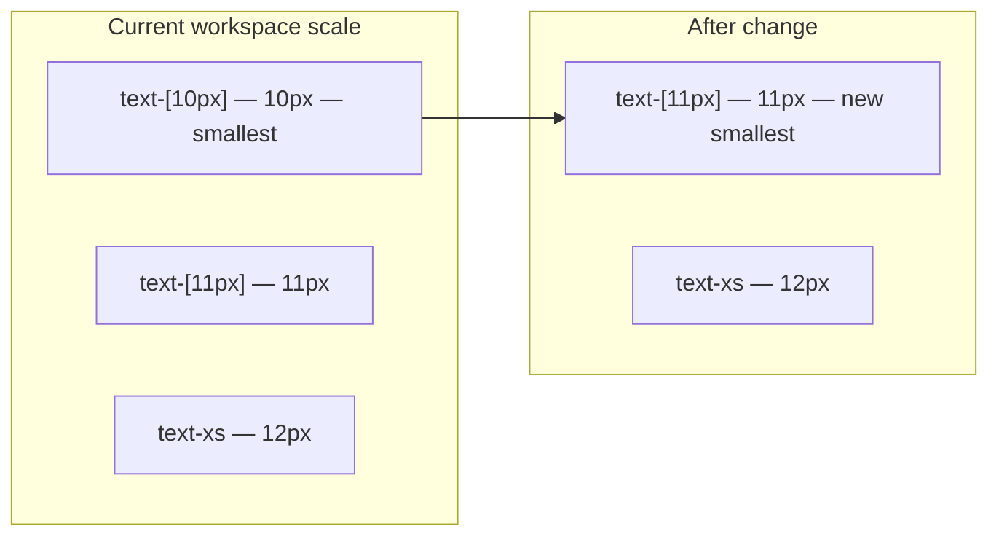

# Increase workspace smallest font size (+1px)

## Current state

Workspace typography uses Tailwind utility classes inline — there is no shared workspace font token in [`app/globals.css`](app/globals.css) or a Tailwind theme extension.

The **smallest** size in workspace is `text-[10px]` (10px). The next tier up is `text-[11px]` (11px), then `text-xs` (12px / 0.75rem).



## Scope

**In scope:** all 17 instances of `text-[10px]` under [`components/workspace/`](components/workspace/) (8 files).

**Out of scope:** `text-[11px]`, `text-xs`, and smaller sizes in other areas (idea-arena, dashboard, etc.) — the request targets workspace only.

## Files to update

| File | Occurrences |
|------|-------------|
| [`components/workspace/project-roadmap-panel.tsx`](components/workspace/project-roadmap-panel.tsx) | 5 (status badges, blocker/helper text) |
| [`components/workspace/project-journey-panel.tsx`](components/workspace/project-journey-panel.tsx) | 4 (draft badge, status badges) |
| [`components/workspace/organizer-skill-files.tsx`](components/workspace/organizer-skill-files.tsx) | 2 (skill tag, timestamp) |
| [`components/workspace/workspace-progress-panel.tsx`](components/workspace/workspace-progress-panel.tsx) | 2 (task labels, status badges) |
| [`components/workspace/workspace-files-panel.tsx`](components/workspace/workspace-files-panel.tsx) | 1 (category pill) |
| [`components/workspace/workspace-messages-panel.tsx`](components/workspace/workspace-messages-panel.tsx) | 1 (urgent badge) |
| [`components/workspace/workspace-project-picker.tsx`](components/workspace/workspace-project-picker.tsx) | 1 (section header) |
| [`components/workspace/progress-task-row.tsx`](components/workspace/progress-task-row.tsx) | 1 (task type label) |

## Change

In each file above, replace:

```tsx
text-[10px]
```

with:

```tsx
text-[11px]
```

No layout or padding changes are required — badges and pills already use `px-1.5` / `px-2` / `py-0.5` padding that accommodates the 1px increase.

## Verification

After edits, visually spot-check in the workspace:

- Project picker sidebar section labels
- Progress panel status badges and task type labels
- Roadmap / journey panel status pills and blocker text
- Files panel category tags
- Messages panel "Urgent" badge
- Organizer skill file tags and timestamps

Optional quick grep to confirm zero remaining `text-[10px]` in `components/workspace/`.
