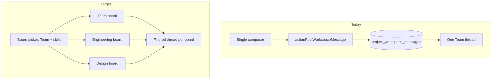

# Workspace Messages Upgrade

## Current state

Messaging is a **single project-wide thread** in [`components/workspace/workspace-shell.tsx`](components/workspace/workspace-shell.tsx) with no delete, no urgent flag, no send spinner, and refresh only after posting. Data lives in `project_workspace_messages` ([`supabase/migrations/0061_project_workspace.sql`](supabase/migrations/0061_project_workspace.sql)) with no skill scoping — unlike files, which already use `job_category` ([`supabase/migrations/012_workspace_file_skill_metadata.sql`](supabase/migrations/012_workspace_file_skill_metadata.sql)).



## 1. Database migration

Add a new migration (e.g. `013_workspace_message_skill_urgent_delete.sql`):

```sql
alter table public.project_workspace_messages
  add column if not exists job_category text null,
  add column if not exists is_urgent boolean not null default false,
  add column if not exists deleted_at timestamptz null,
  add column if not exists deleted_by_clerk_user_id text null;

create index if not exists project_workspace_messages_project_board_created_idx
  on public.project_workspace_messages (project_id, job_category, created_at)
  where deleted_at is null;
```

- **`job_category`**: `null` = Team (project-wide) board; otherwise matches `ProfessionalJobCategory` strings from [`lib/professional-onboarding.ts`](lib/professional-onboarding.ts)
- **Existing rows**: remain `job_category = null` → Team board (no data backfill needed)
- **Soft delete**: mirror file pattern in [`lib/workspace.ts`](lib/workspace.ts) (`softDeleteWorkspaceFile`)

## 2. Server layer ([`lib/workspace.ts`](lib/workspace.ts))

Extend types and functions:

| Change | Detail |
|--------|--------|
| `WorkspaceMessageRow` / `WorkspaceMessageDTO` | Add `job_category`, `is_urgent`, `deleted_at`, `deleted_by_clerk_user_id` |
| `listWorkspaceMessages` | Filter `.is("deleted_at", null)`; optional `jobCategory?: string \| null` param (pass sentinel or overload for Team vs skill) |
| `postWorkspaceMessage` | Accept `jobCategory: string \| null`, `isUrgent: boolean`; validate category is in project's `required_job_categories` when non-null; on reply, require parent in same board |
| `softDeleteWorkspaceMessage` | New — set `deleted_at` / `deleted_by_clerk_user_id`, emit activity |
| Activity payloads | `message_posted`: `{ message_id, job_category?, is_urgent? }`; new `message_deleted`: `{ message_id, job_category? }` |

Add a small display helper (e.g. `messageBoardLabel(category: string | null): string`):
- `null` → **"Team message board"**
- `"Engineering / product"` → **"Engineering message board"** (text before ` / `, or first segment)

## 3. Server actions ([`app/idea-arena/[projectId]/workspace/actions.ts`](app/idea-arena/[projectId]/workspace/actions.ts))

- **`actionPostWorkspaceMessage`**: add `jobCategory`, `isUrgent` args; pass through to `postWorkspaceMessage`
- **`actionDeleteWorkspaceMessage`**: new — auth via `canAccessWorkspace`; allow **author or project owner** (same rule as file delete in `actionDeleteWorkspaceFile`)
- Both call `revalidatePath(workspacePath(projectId))`

## 4. Page wiring ([`app/idea-arena/[projectId]/workspace/page.tsx`](app/idea-arena/[projectId]/workspace/page.tsx))

- Pass extended message DTO fields
- Pass `requiredJobCategories` (from arena project) to the messages panel for board list
- Extend URL params:
  - `?tab=messages&board=team` — Team board (default)
  - `?tab=messages&board=<url-encoded category>` — skill board
  - Keep `?m=<message-id>` for permalinks; auto-select board from message's `job_category`

## 5. New UI component: `WorkspaceMessagesPanel`

Extract messages UI from [`workspace-shell.tsx`](components/workspace/workspace-shell.tsx) into [`components/workspace/workspace-messages-panel.tsx`](components/workspace/workspace-messages-panel.tsx).

### Board picker (top of Messages tab)

Horizontal pill nav or vertical sub-nav:

- **Team message board** (always shown)
- One pill per `required_job_categories` entry, labeled via `messageBoardLabel()`

Active board synced to URL `board` param; invalid/missing board defaults to `team`.

### Per-board thread

- Filter client-side (or server-side via prop) to messages where `job_category` matches active board
- Header shows full board name + optional count of urgent messages in board
- **Refresh button** (top-right): calls `router.refresh()`; show subtle loading state while refreshing (reuse `useTransition` pattern from [`workspace-progress-panel.tsx`](components/workspace/workspace-progress-panel.tsx))

### Message row

- **Urgent**: red/amber badge ("Urgent"), stronger border/background on row
- **Reply**: scoped to same board; permalink includes `board` + `m` params
- **Delete**: two-step confirm (mirror [`organizer-skill-files.tsx`](components/workspace/organizer-skill-files.tsx) — confirm → delete → refresh); only show for author/owner; hide or show "[removed]" for deleted (filtered out server-side)
- Remove or demote raw `id: {uuid}` debug line (keep permalink behavior via reply links)

### Composer

- Textarea + **"Mark as urgent"** checkbox
- Hidden `job_category` field scoped to active board
- **`useTransition` + `msgPending`**: disable textarea + Send while pending; button shows spinner (`Loader2`) + "Sending…" — prevents triple-send
- On success: clear reply + urgent checkbox + refresh

### Status block

Keep "Your status" presence form below the board (unchanged behavior).

## 6. Activity feed emphasis ([`workspace-shell.tsx`](components/workspace/workspace-shell.tsx))

Update `activityDescription()`:

| Kind | Copy |
|------|------|
| `message_posted` + urgent | **"Posted an urgent message"** + board suffix when `job_category` set (e.g. "for Engineering") |
| `message_posted` (normal) | "Posted a message" + board suffix |
| `message_deleted` | "Removed a message" + board suffix |

Visual emphasis in Activity list:
- Urgent message activities: amber/red left border or bold label (match urgent in-thread styling)
- Link from activity to message permalink when `payload.message_id` present (`?tab=messages&board=...&m=...`)

## 7. Permalinks and navigation

Update link generation throughout messages panel:

```
?tab=messages&board=team&m=<uuid>
?tab=messages&board=Engineering%20%2F%20product&m=<uuid>
```

When `highlightMessageId` is set, auto-switch to that message's board (extend existing scroll-into-view effect in shell/panel).

## 8. Files to touch

| File | Change |
|------|--------|
| `supabase/migrations/013_workspace_message_skill_urgent_delete.sql` | New schema |
| `lib/workspace.ts` | Types, list/post/delete, board label helper |
| `app/idea-arena/[projectId]/workspace/actions.ts` | Extended post + delete action |
| `app/idea-arena/[projectId]/workspace/page.tsx` | Extended DTO + board param |
| `components/workspace/workspace-messages-panel.tsx` | **New** — full messages UX |
| `components/workspace/workspace-shell.tsx` | Replace inline messages block with panel; extend activity descriptions |

## Out of scope (per your choices)

- Email/push notifications
- Embedding message boards inside Organizer skill sections
- Message boards for custom `project_required_skills` (display-only skills)
- Supabase Realtime / live polling (manual refresh only for MVP; can add interval polling later if desired)

## Test plan

1. **Team board**: post normal + urgent message; verify thread, Activity feed copy, and permalink highlight
2. **Skill board**: switch to Engineering (or project's first skill); post message; confirm it does not appear on Team board
3. **Send guard**: click Send rapidly — only one message created; button disabled with spinner during send
4. **Refresh**: post from another browser/session; click Refresh — new message appears
5. **Reply**: reply within same board; attempt cross-board reply via tampered parent id — server rejects
6. **Delete**: author deletes own message; owner deletes member message; non-author member cannot delete
7. **Urgent Activity**: urgent post shows emphasized activity row with board context; normal post does not
8. **Legacy data**: existing messages appear on Team board with no migration issues
