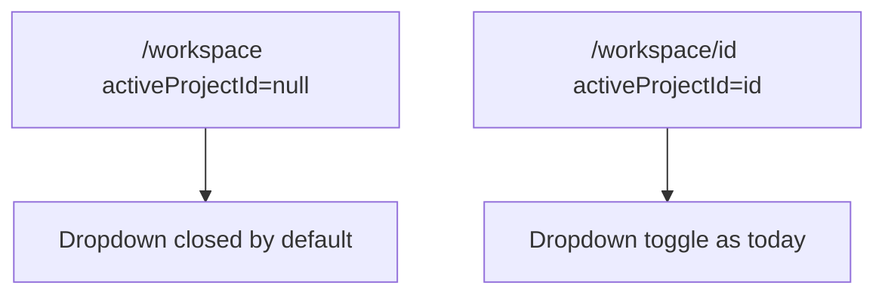
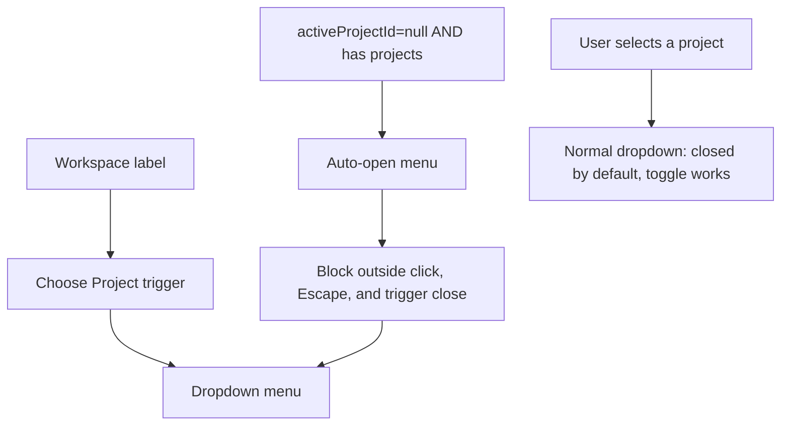

# Workspace label and sticky project picker

## Goal

Two UX tweaks to the sidebar project picker in [`components/workspace/workspace-project-picker.tsx`](components/workspace/workspace-project-picker.tsx):

1. Add a **Workspace** section label directly above the **Choose Project** trigger.
2. When the user has **not** selected a project (`activeProjectId === null`, i.e. `/workspace`), **auto-open** the dropdown and **prevent closing** until they pick a specific project.

No routing, shell, or server-loader changes.

---

## Current behavior

[`WorkspaceProjectPicker`](components/workspace/workspace-project-picker.tsx) renders:

- A single **Choose Project** trigger button
- An [`AnchoredMenuPanel`](components/workspace/anchored-menu-panel.tsx) dropdown (closed by default) with **All Projects**, **My projects**, and **Teams I'm on**

[`WorkspaceDashboardShell`](components/workspace/workspace-dashboard-shell.tsx) passes `activeProjectId={null}` on `/workspace`. [`WorkspaceShell`](components/workspace/workspace-shell.tsx) passes the real `projectId` on `/workspace/[projectId]`.



---

## Target behavior



| State | Label | Trigger | Dropdown |
|-------|-------|---------|----------|
| No project selected (`/workspace`) | **Workspace** (new) | **Choose Project** (unchanged text) | Auto-open; stays open until a project row is clicked |
| Project selected (`/workspace/[id]`) | **Workspace** (new) | **Choose Project** | Current behavior (toggle open/close) |

**Edge cases**

- User has **no** owned/joined projects: only **All Projects** exists — skip forced-open (nothing to pick); normal closed dropdown.
- Clicking **All Projects** while already on `/workspace`: menu stays open (still no project selected).
- Selecting a project: call `setMenuOpen(false)` directly in `selectProject` (bypass the no-close guard), then navigate — after route change, normal dropdown mode applies.

---

## Implementation (single file)

**File:** [`components/workspace/workspace-project-picker.tsx`](components/workspace/workspace-project-picker.tsx)

### 1. Add section label

Insert above the trigger button, matching the **Team** section style in [`workspace-team-roster.tsx`](components/workspace/workspace-team-roster.tsx):

```tsx
<p className="text-xs font-semibold text-slate-400 uppercase tracking-wide mb-2 px-1">
  Workspace
</p>
```

Place inside the existing picker container (`border-b border-slate-600/80 p-3 pb-4`), immediately before the trigger.

### 2. Derive forced-open state

```tsx
const hasProjects = owned.length > 0 || joined.length > 0;
const forceMenuOpen = activeProjectId === null && hasProjects;
```

### 3. Auto-open on `/workspace`

```tsx
useEffect(() => {
  if (forceMenuOpen) setMenuOpen(true);
}, [forceMenuOpen]);
```

### 4. Guard close behavior

Update `closeMenu` so it no-ops when `forceMenuOpen` is true. Update existing dismiss handlers to respect the guard:

- **Outside pointer down** (existing `useEffect`): skip `closeMenu()` when `forceMenuOpen`
- **Escape** (same effect): skip when `forceMenuOpen`
- **Trigger click**: when `forceMenuOpen`, do not toggle closed — either no-op or force `setMenuOpen(true)`

In `selectProject`, always `setMenuOpen(false)` before `router.push` so the menu closes cleanly on navigation.

In `selectAll`, only close when leaving a project view (`activeProjectId !== null`); on `/workspace` the menu remains open.

### 5. Visual affordance

When `forceMenuOpen && menuOpen`, keep chevron rotated (`rotate-180`) and trigger in active styling — same as today when `menuOpen` is true.

---

## Files touched

| File | Change |
|------|--------|
| [`components/workspace/workspace-project-picker.tsx`](components/workspace/workspace-project-picker.tsx) | Label + forced-open logic |

No changes to [`workspace-app-shell.tsx`](components/workspace/workspace-app-shell.tsx), pages, or server loaders.

---

## Manual test plan

- On `/workspace` with 1+ projects: **Workspace** label visible; dropdown opens automatically; clicking outside / Escape / trigger does **not** close it
- Pick a project from dropdown → navigates to `/workspace/[id]`; dropdown closes and behaves normally (toggle open/close)
- From a project, pick **All Projects** → returns to `/workspace`; dropdown auto-opens again and stays sticky
- User with zero projects: label shows; dropdown does **not** force-open (only **All Projects** option)
- On `/workspace/[id]`: **Workspace** label + **Choose Project** trigger; dropdown closed until clicked
