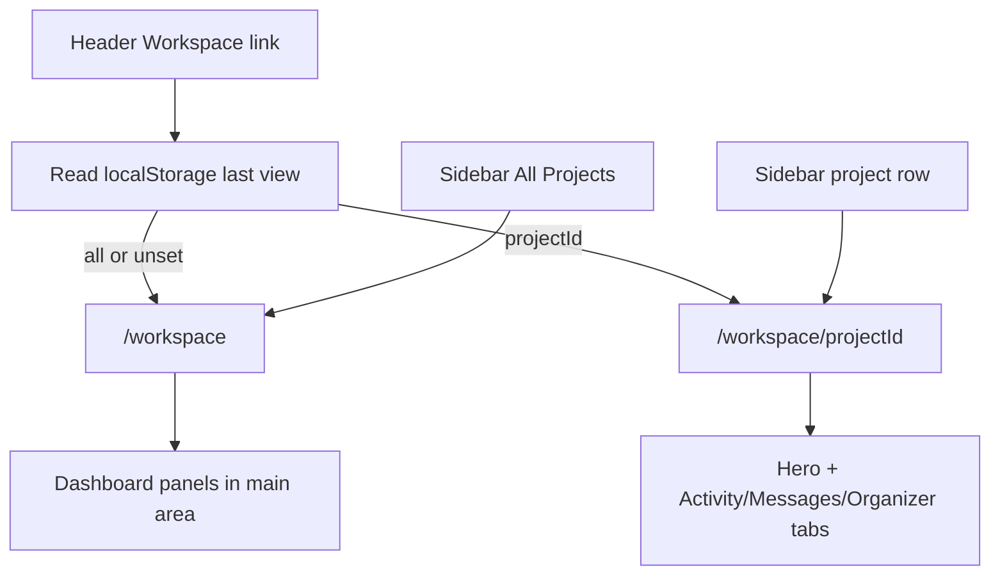

# Unified workspace hub with project picker

## Goal

Replace the separate dashboard experience with a single **workspace hub** at [`/workspace`](app/workspace/page.tsx). The existing dark sidebar gains a **Projects** section at the top: **All Projects** (dashboard) plus grouped project entries (owned as inventor / joined as team member). Selecting a project navigates to that project's workspace in the same shell; **All Projects** shows the current dashboard content in the main pane. Each project workspace gets a **hero banner** from its existing `representative_image_path` (picsum fallback via [`arenaProjectImageUrl`](components/idea-arena/utils.ts)).

No standalone `/dashboard` URL — redirect it to `/workspace`. Remember whether the user last viewed **All Projects** or a specific project so header/CTA links reopen the right place.

---

## Routing

| URL | View |
|-----|------|
| `/workspace` | All Projects (dashboard panels) |
| `/workspace/[projectId]` | Single-project workspace (tabs + hero) |
| `/dashboard` | **301/redirect** → `/workspace` (preserve `?tab=inventor\|professional`) |
| `/idea-arena/[projectId]/workspace` | **Redirect** → `/workspace/[projectId]` (preserve `?tab`, `?board`, `?m`, `?file`) |



---

## Layout architecture

Extract a shared shell used by both routes:

```
WorkspaceAppShell (new)
├── WorkspaceProjectPicker (sidebar top — always visible)
├── WorkspaceProjectNav (sidebar — only when projectId set)
│   └── Activity / Messages / Organizer / Meeting / Settings
├── WorkspaceTeamRoster (sidebar bottom — only when projectId set)
└── main slot
    ├── WorkspaceDashboardPanel (when no projectId)
    └── WorkspaceProjectMain (when projectId)
        ├── WorkspaceProjectHero (new)
        └── existing tab panels from workspace-shell.tsx
```

Refactor [`components/workspace/workspace-shell.tsx`](components/workspace/workspace-shell.tsx): split sidebar picker/nav/roster into new components; keep tab state + panel rendering in a slimmer `WorkspaceProjectMain`. Avoid duplicating tab logic.

Shared page chrome (unchanged pattern): `ArenaHeader` + footer, same as current [`app/idea-arena/[projectId]/workspace/page.tsx`](app/idea-arena/[projectId]/workspace/page.tsx).

---

## Sidebar project picker

New [`components/workspace/workspace-project-picker.tsx`](components/workspace/workspace-project-picker.tsx) (client):

- **Label:** `Projects` (uppercase tracking, matches Team section style)
- **All Projects** row at top — links to `/workspace`; highlighted when no `projectId`
- **My projects** group — inventor-owned (`projects.clerk_user_id = userId`)
- **Teams I'm on** group — joined via `project_members`
- Each row: small thumbnail (32×32 rounded, `next/image` + `arenaProjectImageUrl`) + truncated title
- Active row: `bg-slate-500/80` (same as active tab)
- Empty groups hidden; if user has no projects at all, only **All Projects** shows

On select: `router.push(targetUrl)` and persist choice (see below).

---

## Persist last workspace view

New client helper [`lib/workspace-last-view.ts`](lib/workspace-last-view.ts):

- Key: `ven-shares:workspace-last-view:{userId}`
- Values: `"all"` | `{projectId}`
- **Write** on picker navigation and when landing on `/workspace` (`all`) or `/workspace/[projectId]`
- **Read** in [`components/idea-arena/arena-header.tsx`](components/idea-arena/arena-header.tsx) (client wrapper or small `WorkspaceNavLink` client component) to resolve header href:
  - `"all"` or missing → `/workspace`
  - project UUID → `/workspace/{id}` (default tab preserved by server default)

Rename header link label from **Dashboard** → **Workspace**.

Update other `/dashboard` links ([`app/page.tsx`](app/page.tsx), [`app/idea-arena/page.tsx`](app/idea-arena/page.tsx), [`app/dashboard/profile/page.tsx`](app/dashboard/profile/page.tsx) back link) to `/workspace` or the smart workspace link.

---

## Dashboard content in main area

Extract dashboard body from [`app/dashboard/page.tsx`](app/dashboard/page.tsx) into [`components/workspace/workspace-dashboard-panel.tsx`](components/workspace/workspace-dashboard-panel.tsx):

- Reuse as-is: `DashboardRoleTabs`, `DashboardAddProjectHeader`, `DashboardProfessionalHeader`, `DashboardProjectProgressStack`, `AddOppositeRolePrompt`, empty states
- Update `DashboardRoleTabs` hrefs to `/workspace?tab=...`
- Props: same server-loaded data the dashboard page already fetches (roles, projects, bundles, onboarding flags)

[`app/workspace/page.tsx`](app/workspace/page.tsx) (new server page): mirror current dashboard data loading, wrap in `WorkspaceAppShell` with `activeProjectId={null}`, render `WorkspaceDashboardPanel` in main slot.

[`app/workspace/[projectId]/page.tsx`](app/workspace/[projectId]/page.tsx) (new): move logic from current workspace page; pass picker data + project workspace props into shell.

---

## Project hero banner

New [`components/workspace/workspace-project-hero.tsx`](components/workspace/workspace-project-hero.tsx):

- Full-width strip above tab content (~`h-36` md:`h-44`)
- `Image` with `fill` + `object-cover` using `arenaProjectImageUrl`
- Bottom gradient overlay (`from-black/60`) for contrast
- Project title + **Arena Preview** link (`/idea-arena/{id}`) overlaid
- Replaces the current plain white title bar in [`workspace-shell.tsx`](components/workspace/workspace-shell.tsx) (lines 427–437)

---

## Data loading

New [`lib/workspace-project-picker.server.ts`](lib/workspace-project-picker.server.ts):

```ts
export type WorkspacePickerProject = {
  id: string;
  title: string;
  representative_image_path: string | null;
  relation: "owner" | "member";
};

export async function loadWorkspaceProjectPickerForUser(
  userId: string,
): Promise<{
  owned: WorkspacePickerProject[];
  joined: WorkspacePickerProject[];
}>
```

- **Owned:** reuse [`listProjectsForCurrentUser`](app/dashboard/projects/actions.ts) (already has `representative_image_path`)
- **Joined:** extend [`listJoinedProjectsForCurrentUser`](lib/project-members.ts) select to `projects ( id, title, representative_image_path )` and export image on `JoinedProjectRow`

Both workspace pages call this loader for the sidebar picker (one lightweight query per page load; no new tables).

---

## Redirects and link updates

| File | Change |
|------|--------|
| `app/dashboard/page.tsx` | Replace body with `redirect("/workspace")` (+ `?tab` passthrough) |
| `app/idea-arena/[projectId]/workspace/page.tsx` | Replace with redirect to `/workspace/[projectId]` |
| `components/idea-arena/arena-header.tsx` | Workspace smart link |
| `components/dashboard/dashboard-role-tabs.tsx` | `/workspace?tab=...` |
| `components/dashboard/dashboard-mini-project-strip.tsx` | Links → `/workspace/{id}?tab=organizer` |
| `components/dashboard/dashboard-project-progress-card.tsx` | Same |
| `components/idea-arena/project-detail-view.tsx` | Open workspace → `/workspace/{id}` |
| `app/dashboard/projects/actions.ts` | `revalidatePath("/workspace")` alongside existing paths |
| `app/idea-arena/[projectId]/workspace/actions.ts` | Update `workspacePath()` helper to `/workspace/{id}` |

---

## UX behavior summary

| State | Sidebar | Main area |
|-------|---------|-----------|
| All Projects | Picker only (no Activity/Messages tabs; no Team roster) | Full dashboard (role tabs if dual-role) |
| Project selected | Picker + workspace tabs + Team roster | Hero + active tab panel |

Dual-role users see **both** picker groups when applicable. Inventor-only sees **My projects**; professional-only sees **Teams I'm on**.

---

## Manual test plan

- Inventor with 2 owned projects: picker shows **All Projects** + **My projects** group; **All Projects** shows add-project + progress stack; selecting a project shows hero + organizer/messages tabs
- Professional on 1 team: **Teams I'm on** group; no **My projects** section
- Dual-role: both groups; role tabs on All Projects view; `?tab=professional` works on `/workspace`
- Leave on All Projects → click Idea Arena → click Workspace in header → returns to `/workspace`
- Leave on project A → navigate away → Workspace header link → returns to `/workspace/A`
- Old URLs `/dashboard`, `/idea-arena/{id}/workspace?tab=organizer` redirect correctly
- Project without custom image: hero uses picsum seed fallback
- Team member: no Settings tab; owner: Settings tab present
