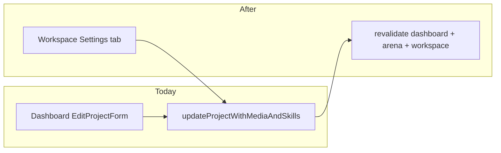

# Workspace project settings tab

## Non-goals (unchanged)

- **Keep dashboard project settings as-is** — [`EditProjectForm`](components/dashboard/edit-project-form.tsx) stays inline on each project in [`app/dashboard/page.tsx`](app/dashboard/page.tsx). This plan does **not** remove, relocate, or replace that UI.
- **Single shared form + action** — both dashboard and workspace call the same `EditProjectForm` and `updateProjectWithMediaAndSkills`; inventors can edit from either place.

## Current state

- **Edit UI exists only on the dashboard** — [`EditProjectForm`](components/dashboard/edit-project-form.tsx) on [`app/dashboard/page.tsx`](app/dashboard/page.tsx) edits title, description, representative image, team categories, and required skills.
- **Server action is ready** — [`updateProjectWithMediaAndSkills`](app/dashboard/projects/actions.ts) already enforces inventor + project-owner auth, syncs workspace progress checklist when categories change, and revalidates `/dashboard`, `/idea-arena`, and `/idea-arena/[id]` — but **not** the workspace route.
- **Workspace already loads edit data** — [`app/idea-arena/[projectId]/workspace/page.tsx`](app/idea-arena/[projectId]/workspace/page.tsx) calls `getProjectByIdForArena(projectId)`, which returns the same fields `EditProjectForm` needs (`id`, `title`, `description`, `required_job_categories`, `representative_image_path`, `project_required_skills`).
- **Owner detection exists** — [`getWorkspaceAccessFlags`](lib/workspace-access.ts) returns `{ canAccess, isOwner }` (workspace page currently only uses `assertWorkspaceAccess`).



## Implementation

### 1. Load owner flag + project on workspace page

In [`app/idea-arena/[projectId]/workspace/page.tsx`](app/idea-arena/[projectId]/workspace/page.tsx):

- After `assertWorkspaceAccess`, call `getWorkspaceAccessFlags(projectId, userId)`.
- Pass new props to `WorkspaceShell`:
  - `isProjectOwner: flags.isOwner`
  - `editableProject: flags.isOwner ? arenaProject : null` (only send edit payload to the client when owner — avoids exposing edit affordance data unnecessarily to members, though fields are mostly public anyway)

No new DB query is required; `arenaProject` is already fetched.

### 2. Add owner-only Settings tab — [`components/workspace/workspace-shell.tsx`](components/workspace/workspace-shell.tsx)

- Import `Settings` from `lucide-react`.
- Extend tab union with `"settings"` (either append to `TABS` or define owner tabs separately so members never see the nav item).
- Render Settings tab button **only when `isProjectOwner`**.
- Add tab panel content matching other tabs (white card, `max-w-3xl`):

```tsx
{tab === "settings" && editableProject ? (
  <div className="max-w-3xl rounded-2xl border border-slate-200 bg-white shadow-sm p-6">
    <h2 className="text-base font-semibold text-slate-900 mb-1">Project settings</h2>
    <p className="text-sm text-slate-600 mb-4">
      Update how this project appears in Idea Arena and what skills professionals need to join.
    </p>
    <EditProjectForm project={editableProject} variant="workspace" />
  </div>
) : null}
```

- **Guard deep links**: if `?tab=settings` but user is not owner, fall back to `"messages"` (same pattern as invalid tab ids today via `isTabId`).

### 3. Light `EditProjectForm` tweaks — [`components/dashboard/edit-project-form.tsx`](components/dashboard/edit-project-form.tsx)

- Add optional `variant?: "dashboard" | "workspace"` (default `"dashboard"`).
- **Workspace variant**: drop the dashboard-only top border (`border-t border-slate-100`); optionally bump label/input sizing to `text-sm` to match other workspace panels.
- On successful save (`state.ok`), call `router.refresh()` so:
  - Workspace header title updates immediately
  - Progress tab category statuses refresh after category changes
- Keep using the existing `updateProjectWithMediaAndSkills` action — no duplicate server logic.

### 4. Revalidate workspace path on project update

In [`updateProjectWithMediaAndSkills`](app/dashboard/projects/actions.ts), add:

```ts
revalidatePath(`/idea-arena/${projectId}/workspace`);
```

(Mirror the helper already used in [`app/idea-arena/[projectId]/workspace/actions.ts`](app/idea-arena/[projectId]/workspace/actions.ts): `workspacePath(projectId)`.)

## Access control

| Layer | Behavior |
|-------|----------|
| **UI** | Settings tab visible only when `isProjectOwner` |
| **Server** | `updateProjectWithMediaAndSkills` already requires `venRole === "inventor"` and `.eq("clerk_user_id", userId)` — team members cannot save even if they craft a request |

## Files touched

- [`app/idea-arena/[projectId]/workspace/page.tsx`](app/idea-arena/[projectId]/workspace/page.tsx) — owner flags + props
- [`components/workspace/workspace-shell.tsx`](components/workspace/workspace-shell.tsx) — Settings tab + panel
- [`components/dashboard/edit-project-form.tsx`](components/dashboard/edit-project-form.tsx) — workspace variant + `router.refresh()` on success (**dashboard usage unchanged**)
- [`app/dashboard/projects/actions.ts`](app/dashboard/projects/actions.ts) — workspace `revalidatePath`

## Verification

- **Inventor / owner**: open workspace → Settings tab appears → edit title/categories/skills/image → save → header title and Idea Arena project page reflect changes without visiting dashboard.
- **Professional / member**: Settings tab not shown; `?tab=settings` falls back to messages; direct POST to update action still rejected.
- **Category change**: after removing/adding a required category, Progress tab checklist trims/merges correctly (existing server logic).
- **Dashboard**: existing inline edit on dashboard still works unchanged.
