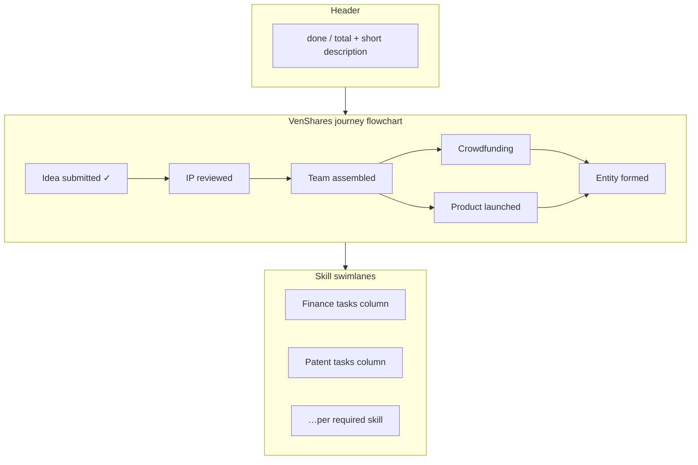

# Workspace Roadmap flowchart tab

## Goal

Add a **Roadmap** sidebar tab (`?tab=roadmap`) that reuses the existing progress graph from [`lib/workspace-progress-graph.ts`](lib/workspace-progress-graph.ts) — the same data powering [`ProjectJourneyPanel`](components/workspace/project-journey-panel.tsx) — and presents it as a visual flowchart instead of a checklist list.

Per your choices: **view-only** completion state on the roadmap; clicking a node navigates to the right workspace area to take action.

## Data (no new API)

Reuse props already loaded in [`app/workspace/[projectId]/page.tsx`](app/workspace/[projectId]/page.tsx) via `loadWorkspaceOrganizerBundle`:

| Prop | Source | Roadmap use |
|------|--------|-------------|
| `progressChecklist` | bundle | build graph |
| `progressMilestoneState` | bundle | milestone completion |
| `requiredJobCategories` | meta | skill sections |
| `categoryCoverage` | bundle | team lead + member avatars per skill |

Client-side graph build (same as Journey):

```ts
buildProgressGraph(checklist, milestoneState, requiredCategories)
```

No migration, server action, or bundle changes required.

## Tab wiring

In [`components/workspace/workspace-shell.tsx`](components/workspace/workspace-shell.tsx):

- Add to `TABS`: `{ id: "roadmap", label: "Roadmap", icon: Map }` (Lucide `Map` or `GitBranch`)
- Place after **Journey** (both are progress views)
- Render new panel when `tab === "roadmap"`
- Pass: `projectId`, `checklist`, `milestoneState`, `requiredCategories`, `categoryCoverage`

`resolveTabId` already accepts any `TABS` id — no change needed beyond the array.

## New component: `ProjectRoadmapPanel`

Create [`components/workspace/project-roadmap-panel.tsx`](components/workspace/project-roadmap-panel.tsx).

### Layout (two zones, no new npm deps)



**Zone 1 — Milestone flowchart (fixed DAG layout)**

The 6 milestone nodes and their `dependsOn` edges are known in code ([`MILESTONE_DEFS`](lib/workspace-progress-graph.ts)). Use a **hardcoded grid layout** + inline **SVG** connector lines (not a graph library — keeps bundle lean and matches the fixed milestone shape):

```
[M0] → [M1] → [M2] ──→ [M3] ──→ [M5]
                  └──→ [M4] ──↗
```

Each milestone card shows:
- Check icon (green) or empty circle for incomplete
- Title + locked/ready styling from `node.locked` / `node.completed`
- For **Team assembled** (`std:journey:2`): compact project roster snippet (first few avatars from sidebar roster data passed as optional prop, or skills-covered summary)
- Whole card is a `<button>` / link → `/workspace/{id}?tab=journey&node={nodeId}`

**Zone 2 — Skill task swimlanes**

One horizontal-scroll column per required skill (`view.sections` where `id !== "venShares-journey"`):

- Column header: skill name + `{done}/{total}` for that category
- **Team row**: reuse compact avatar pattern from [`SkillTeamRoster`](components/idea-arena/skill-team-roster.tsx) (`variant="compact"`) via `categoryCoverage`
- Vertical stack of task cards (all leaves from graph — same as Journey list)
- Each card: checkmark, title, locked badge if `node.locked`
- Click behavior:
  - **Task card** → `?tab=journey&node={nodeId}` (scroll to row in Journey)
  - **Team avatars / column header** → `?tab=organizer&skill={category}` (expand skill accordion)

Cross-linked skill tasks (the 3 curated deps to milestones) show a small “Requires: …” chip from `node.blockers` when locked — same text model as Journey, no cross-canvas SVG lines needed in v1.

### Styling conventions

Match existing workspace palette:
- Completed: emerald check + muted/strikethrough title (mirror [`MilestoneRow`](components/workspace/project-journey-panel.tsx))
- Locked: slate opacity + “Locked” chip
- Ready: white card, sky “Ready” chip
- Hover on clickable cards: subtle ring / underline cue

Responsive: milestone row scrolls horizontally on narrow screens; skill columns scroll horizontally below.

## Deep links (required for “clickable to go to that area”)

### Journey node anchor — [`project-journey-panel.tsx`](components/workspace/project-journey-panel.tsx)

- Read `node` from `useSearchParams()`
- Add `id={`journey-node-${node.id}`}` on each row wrapper
- On mount / param change: `scrollIntoView({ block: "center" })` + temporary highlight ring (3s fade)
- Optionally auto-expand that row’s detail panel

### Organizer skill expand — [`workspace-progress-panel.tsx`](components/workspace/workspace-progress-panel.tsx)

- Read `skill` from `useSearchParams()` (URL-encoded category name)
- On mount: call existing `expandSkill(category)` from [`useWorkspaceSkillExpand`](lib/use-workspace-skill-expand.ts)
- Scroll expanded skill accordion into view

### Page searchParams type (optional cleanup)

Extend [`app/workspace/[projectId]/page.tsx`](app/workspace/[projectId]/page.tsx) `searchParams` type to include `node?: string; skill?: string` for TypeScript clarity (values consumed client-side only).

## Optional layout helper

If milestone SVG math gets noisy, extract to [`lib/workspace-progress-flowchart-layout.ts`](lib/workspace-progress-flowchart-layout.ts):

```ts
export const MILESTONE_FLOWCHART_NODES = [
  { id: stdJourneyMilestoneId(0), x: 0, y: 0 },
  // …fixed positions for M0–M5
];
export const MILESTONE_FLOWCHART_EDGES = [
  { from: "std:journey:0", to: "std:journey:1" },
  // …from MILESTONE_DEFS dependsOn
];
export function milestoneEdgePath(from, to): string; // SVG d attribute
```

Keeps the panel component focused on rendering.

## Files to touch

| File | Change |
|------|--------|
| [`components/workspace/project-roadmap-panel.tsx`](components/workspace/project-roadmap-panel.tsx) | **New** — flowchart UI |
| [`lib/workspace-progress-flowchart-layout.ts`](lib/workspace-progress-flowchart-layout.ts) | **New** — milestone positions + SVG paths |
| [`components/workspace/workspace-shell.tsx`](components/workspace/workspace-shell.tsx) | Roadmap tab + panel wiring |
| [`components/workspace/project-journey-panel.tsx`](components/workspace/project-journey-panel.tsx) | `node` param scroll/highlight |
| [`components/workspace/workspace-progress-panel.tsx`](components/workspace/workspace-progress-panel.tsx) | `skill` param auto-expand |
| [`app/workspace/[projectId]/page.tsx`](app/workspace/[projectId]/page.tsx) | Optional: extend searchParams type |

## Out of scope (v1)

- Toggling completion on the Roadmap (Journey remains canonical)
- New npm packages (`@xyflow/react`, dagre, mermaid runtime)
- Drawing cross-lane SVG lines from milestones to distant skill tasks
- Auto-completing milestones from team data

## Manual test plan

1. Open `/workspace/{projectId}?tab=roadmap` — milestone flowchart + skill columns render with correct `{done}/{total}`.
2. Completed milestones/tasks show green checkmarks; locked nodes are grayed with prerequisite text.
3. Skill columns show team lead + member avatars from `categoryCoverage`.
4. Click milestone → Journey tab, scrolled/highlighted to that row.
5. Click skill task → Journey tab, scrolled to that task row.
6. Click skill team/header → Organizer tab with that skill accordion expanded.
7. Toggle a task on Journey, return to Roadmap — checkmarks update after refresh/navigation.
8. Mobile: horizontal scroll works for milestone row and skill columns without layout breakage.
