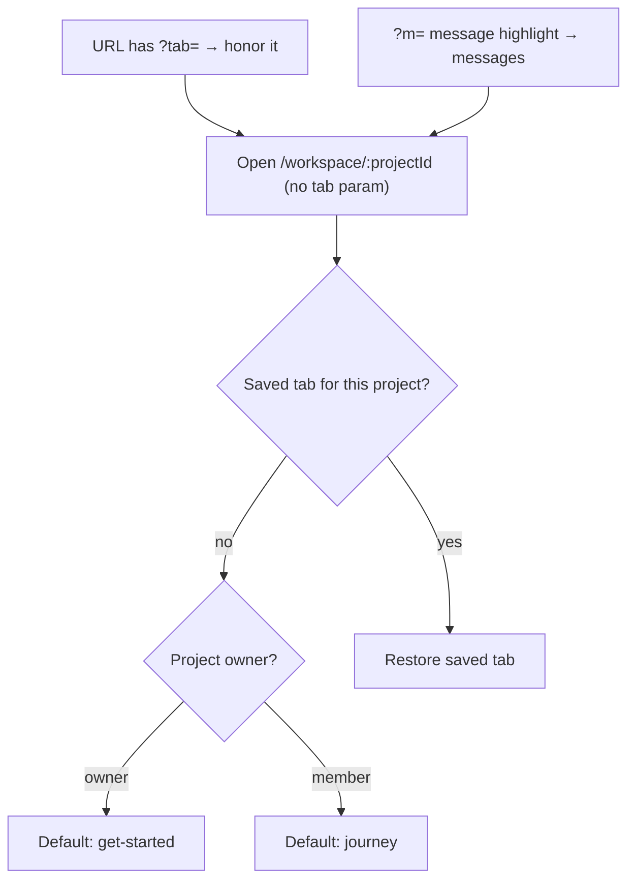

# Workspace tab default and resume

## Problem

Opening a project workspace without `?tab=` always lands on **Messages** today:

```192:192:app/workspace/[projectId]/page.tsx
      initialTab={tab ?? "messages"}
```

The same fallback appears in [`resolveTabId`](components/workspace/workspace-shell.tsx) for unknown/legacy tab values and for non-owners hitting owner-only tabs.

Project persistence already exists in [`lib/workspace-last-view.ts`](lib/workspace-last-view.ts) (stores last project id or `"all"`), but **tab state is never saved**. Many entry points navigate without a tab:

- [`workspace-project-picker.tsx`](components/workspace/workspace-project-picker.tsx) → `/workspace/${id}`
- [`workspace-nav-link.tsx`](components/workspace/workspace-nav-link.tsx) → `/workspace/${lastProjectId}` (no tab)
- [`add-project-panel.tsx`](components/dashboard/add-project-panel.tsx), legacy redirect in [`idea-arena/.../workspace/page.tsx`](app/idea-arena/[projectId]/workspace/page.tsx)

## Desired behavior



- **Resume**: if the user previously viewed Organizer (or any tab) on that project, return there.
- **First visit**: owners → **Get Started**; team members → **Journey**.
- **Explicit links** (`?tab=journey`, arena nav `?tab=get-started`, message deep links) stay unchanged.
- **Message highlight** (`?m=`) still forces Messages (existing effect in shell).

## Implementation

### 1. Extend last-view storage ([`lib/workspace-last-view.ts`](lib/workspace-last-view.ts))

Add per-project tab helpers alongside existing project persistence:

- `workspaceLastTabStorageKey(userId, projectId)` → e.g. `ven-shares:workspace-last-tab:{userId}:{projectId}`
- `readWorkspaceLastTab(userId, projectId): string | null`
- `writeWorkspaceLastTab(userId, projectId, tab: string): void`
- `defaultWorkspaceTab(isProjectOwner): "get-started" | "journey"`
- `resolveWorkspaceTab(userId, projectId, isProjectOwner): string` → stored tab or role default

Update `workspaceHrefForLastView` / `workspaceHrefFromStorage` so the header **Workspace** link returns e.g. `/workspace/{id}?tab=organizer` when that was the last tab (or role default if none).

Export a small set of valid tab ids (or reuse shell’s tab union) so only known tabs are restored.

### 2. Change server-side fallback ([`app/workspace/[projectId]/page.tsx`](app/workspace/[projectId]/page.tsx))

Replace `tab ?? "messages"` with role-based default using `accessFlags.isOwner` (already loaded in this file):

```ts
initialTab={tab ?? (accessFlags.isOwner ? "get-started" : "journey")}
```

This gives a sensible SSR first paint; client will still override with stored tab when present.

### 3. Persist and restore in shell ([`components/workspace/workspace-shell.tsx`](components/workspace/workspace-shell.tsx))

**Persist tab** whenever the user changes views:

- `setTab(next)` → `writeWorkspaceLastTab(currentUserId, projectId, next)`
- `setMessageBoard(...)` → persist `"messages"`

**Restore tab** when URL has no `tab` param:

- On mount (and when `searchParams` lacks `tab`), compute `next = resolveWorkspaceTab(...)` and `router.replace` to canonical URL with `?tab=...` (include default `board=team` when landing on messages, matching existing `setTab` behavior).
- Keep existing `useEffect` that syncs tab from `searchParams` when `tab` is present.

**Update fallbacks in `resolveTabId`:**

| Case | Today | New |
|------|-------|-----|
| Unknown tab id | `messages` | role default (`get-started` / `journey`) |
| Non-owner on `get-started` / `settings` | `messages` | `journey` |
| Legacy `activity` | `messages` | keep `messages` (activity lives under messages) |

Do **not** change highlight-message behavior (`highlightMessageId` → messages).

### 4. Optional link hygiene (low risk, same PR)

Update bare project links to include an explicit tab where it improves clarity (client restore still handles these if skipped):

- [`workspace-project-picker.tsx`](components/workspace/workspace-project-picker.tsx) `selectProject` — could push with `?tab=` from storage; not strictly required once shell restores.

No change to [`lib/workspace-arena-nav.ts`](lib/workspace-arena-nav.ts) (already passes explicit tabs for arena entry).

## Files touched

| File | Change |
|------|--------|
| [`lib/workspace-last-view.ts`](lib/workspace-last-view.ts) | Tab read/write, role default, href includes tab |
| [`app/workspace/[projectId]/page.tsx`](app/workspace/[projectId]/page.tsx) | Server default off Messages |
| [`components/workspace/workspace-shell.tsx`](components/workspace/workspace-shell.tsx) | Persist on tab change, restore on load, fallback updates |

## Verification

1. Open `/workspace/{id}` as **owner** with empty localStorage → lands on **Get Started**.
2. Switch to **Journey**, leave, return via project picker (no `?tab`) → **Journey**.
3. Open as **team member** with no saved tab → **Journey**.
4. Header **Workspace** link after viewing Organizer → opens project on **Organizer**.
5. Deep link `?tab=messages&m={id}` still opens Messages with highlight.
6. Non-owner visiting `?tab=settings` → redirected to **Journey** (not Messages).
